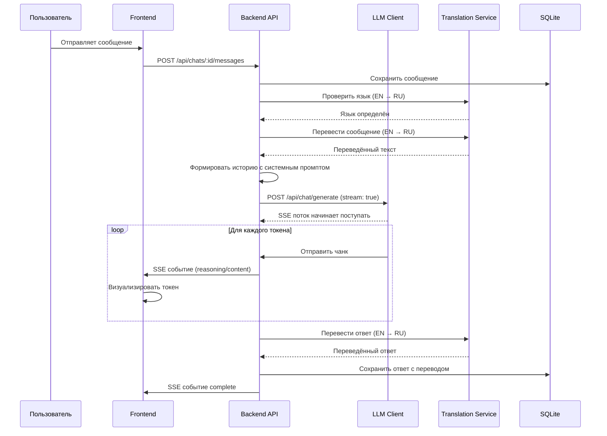
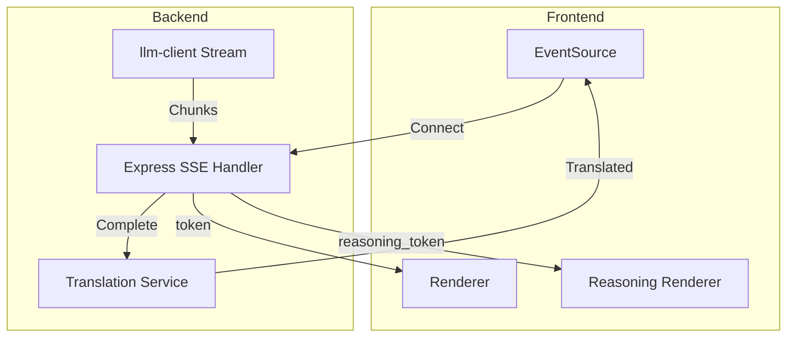

# Архитектура HomeTavern V5

## Обзор проекта

HomeTavern V5 — веб-приложение для взаимодействия с локальными LLM моделями через интерфейс, совместимый с SillyTavern. Приложение поддерживает многопользовательский режим, перевод сообщений между RU и EN, и потоковую генерацию ответов с визуализацией мышления модели.

### Ключевые компоненты

```
┌─────────────────────────────────────────────────────────────────────┐
│                        Frontend (React + Tailwind)                   │
│  ┌──────────────┐  ┌──────────────┐  ┌──────────────┐               │
│  │   Auth UI    │  │   Chat UI    │  │ Admin Panel  │               │
│  └──────────────┘  └──────────────┘  └──────────────┘               │
└─────────────────────────────────────────────────────────────────────┘
                              │
                              │ REST API + SSE
                              ▼
┌─────────────────────────────────────────────────────────────────────┐
│                     Backend (Express.js)                             │
│  ┌──────────────┐  ┌──────────────┐  ┌──────────────┐               │
│  │   Auth       │  │   Chat       │  │   Admin      │               │
│  │  Service     │  │  Service     │  │  Service     │               │
│  └──────────────┘  └──────────────┘  └──────────────┘               │
│  ┌──────────────┐  ┌──────────────┐                                  │
│  │   LLM        │  │ Translation  │                                  │
│  │   Client     │  │   Library    │                                  │
│  └──────────────┘  └──────────────┘                                  │
└─────────────────────────────────────────────────────────────────────┘
                              │
                              │ SQLite
                              ▼
┌─────────────────────────────────────────────────────────────────────┐
│                      SQLite Database                                 │
│  users │ characters │ chats │ messages │ hero_profile │ settings    │
└─────────────────────────────────────────────────────────────────────┘
```

---

## 1. Схема базы данных SQLite

### Таблица `users`

| Колонка       | Тип          | Описание                              |
|---------------|--------------|---------------------------------------|
| `id`          | INTEGER PK   | Первичный ключ, AUTOINCREMENT         |
| `username`    | TEXT UNIQUE  | Уникальное имя пользователя           |
| `password_hash`| TEXT        | Хеш пароля (bcrypt)                   |
| `email`       | TEXT UNIQUE  | Email для восстановления (опционально)|
| `role`        | TEXT         | 'admin' или 'user'                    |
| `language`    | TEXT         | Язык интерфейса: 'ru' или 'en'        |
| `created_at`  | DATETIME     | Дата создания                         |
| `updated_at`  | DATETIME     | Дата последнего обновления            |
| `last_login`  | DATETIME     | Дата последнего входа                 |

### Таблица `settings`

| Колонка       | Тип          | Описание                              |
|---------------|--------------|---------------------------------------|
| `id`          | INTEGER PK   | Первичный ключ                        |
| `user_id`     | INTEGER FK   | Ссылка на users                       |
| `key`         | TEXT         | Ключ настройки                        |
| `value`       | TEXT         | Значение настройки (JSON)             |

**Примеры настроек:**
- `translation_provider`: 'google' | 'yandex' | 'libre' | 'lingva'
- `translation_source_lang`: код языка (auto, ru, en)
- `translation_target_lang`: код языка (ru, en)
- `llm_endpoint`: URL LLM сервера
- `llm_model`: имя модели
- `theme`: 'dark' | 'light'

### Таблица `characters`

| Колонка         | Тип          | Описание                              |
|-----------------|--------------|---------------------------------------|
| `id`            | INTEGER PK   | Первичный ключ                        |
| `user_id`       | INTEGER FK   | Владелец персонажа (NULL для общих)   |
| `name`          | TEXT         | Имя персонажа                         |
| `description`   | TEXT         | Описание персонажа                    |
| `first_message` | TEXT         | Первое сообщение персонажа            |
| `system_prompt` | TEXT         | Системный промпт                      |
| `avatar`        | TEXT         | Путь к аватару или URL                |
| `avatar_data`   | BLOB         | Изображение аватара (опционально)     |
| `is_public`     | BOOLEAN      | Доступен всем пользователям           |
| `created_at`    | DATETIME     | Дата создания                         |
| `updated_at`    | DATETIME     | Дата последнего обновления            |

### Таблица `chats`

| Колонка       | Тип          | Описание                              |
|---------------|--------------|---------------------------------------|
| `id`          | INTEGER PK   | Первичный ключ                        |
| `user_id`     | INTEGER FK   | Владелец чата                         |
| `character_id`| INTEGER FK   | Персонаж в чате                       |
| `title`       | TEXT         | Заголовок чата                        |
| `created_at`  | DATETIME     | Дата создания                         |
| `updated_at`  | DATETIME     | Дата последнего сообщения             |

### Таблица `messages`

| Колонка          | Тип          | Описание                              |
|------------------|--------------|---------------------------------------|
| `id`             | INTEGER PK   | Первичный ключ                        |
| `chat_id`        | INTEGER FK   | Ссылка на chat                        |
| `role`           | TEXT         | 'system' | 'user' | 'assistant' |
| `content`        | TEXT         | Оригинальный контент                  |
| `translated_content`| TEXT      | Переведённый контент (опционально)    |
| `reasoning_content`| TEXT       | Контент мышления (для assistant)      |
| `translated_reasoning`| TEXT    | Переведённое мышление                 |
| `message_id`     | TEXT         | Уникальный ID для llm-client          |
| `hidden`         | BOOLEAN      | Скрыто ли сообщение от LLM            |
| `created_at`     | DATETIME     | Дата создания                         |

**Важно о полях `content` и `translated_content`:**

- **Для сообщений пользователя (`role='user'`):**
  - `content` = оригинал на русском (если пользователь пишет на русском)
  - `translated_content` = перевод на английский (используется при отправке в LLM)

- **Для сообщений ассистента (`role='assistant'`):**
  - `content` = оригинал на английском (ответ от LLM)
  - `translated_content` = перевод на русский (для отображения пользователю)

**При формировании истории для LLM ([`formatMessagesForQwen()`](server/src/services/llm.service.ts:39)):**
- Для `user` сообщений: использовать `translated_content` (английский перевод) или `content` если перевода нет
- Для `assistant` сообщений: использовать `content` (оригинал на английском)

### Таблица `hero_profile`

| Колонка       | Тип          | Описание                              |
|---------------|--------------|---------------------------------------|
| `id`          | INTEGER PK   | Первичный ключ                        |
| `user_id`     | INTEGER FK   | Владелец профиля                      |
| `name`        | TEXT         | Имя героя                             |
| `description` | TEXT         | Описание героя                        |
| `avatar`      | TEXT         | Путь к аватару                        |
| `created_at`  | DATETIME     | Дата создания                         |
| `updated_at`  | DATETIME     | Дата последнего обновления            |

### Индексы

```sql
CREATE INDEX idx_messages_chat_id ON messages(chat_id);
CREATE INDEX idx_messages_created_at ON messages(created_at);
CREATE INDEX idx_chats_user_id ON chats(user_id);
CREATE INDEX idx_chats_updated_at ON chats(updated_at);
CREATE INDEX idx_characters_user_id ON characters(user_id);
CREATE INDEX idx_hero_profile_user_id ON hero_profile(user_id);
```

---

## 2. API Endpoints

### 2.1 Аутентификация

| Метод  | Endpoint                    | Описание                    | Тело запроса                              | Ответ                                    |
|--------|-----------------------------|-----------------------------|-------------------------------------------|------------------------------------------|
| POST   | `/api/auth/register`        | Регистрация пользователя    | `{username, password, email?}`             | `{user, token}`                          |
| POST   | `/api/auth/login`           | Вход                        | `{username, password}`                     | `{user, token}`                          |
| POST   | `/api/auth/logout`          | Выход                       | `{}`                                       | `{success: true}`                        |
| GET    | `/api/auth/me`              | Текущий пользователь        | -                                          | `{user}`                                 |
| POST   | `/api/auth/change-password` | Смена пароля                | `{oldPassword, newPassword}`               | `{success: true}`                        |

### 2.2 Пользователи (Admin)

| Метод  | Endpoint                  | Описание                    | Тело запроса                              | Ответ                                    |
|--------|---------------------------|-----------------------------|-------------------------------------------|------------------------------------------|
| GET    | `/api/admin/users`        | Список пользователей        | -                                          | `{users: User[]}`                        |
| GET    | `/api/admin/users/:id`    | Детали пользователя         | -                                          | `{user}`                                 |
| PUT    | `/api/admin/users/:id`    | Обновление пользователя     | `{username?, email?, role?}`               | `{user}`                                 |
| DELETE | `/api/admin/users/:id`    | Удаление пользователя       | -                                          | `{success: true}`                        |

### 2.3 Персонажи

| Метод  | Endpoint                    | Описание                    | Тело запроса                              | Ответ                                    |
|--------|-----------------------------|-----------------------------|-------------------------------------------|------------------------------------------|
| GET    | `/api/characters`           | Список персонажей           | `?public=true`                             | `{characters: Character[]}`              |
| GET    | `/api/characters/:id`       | Детали персонажа            | -                                          | `{character}`                            |
| POST   | `/api/characters`           | Создание персонажа          | `{name, description, first_message, ...}`  | `{character}`                            |
| PUT    | `/api/characters/:id`       | Обновление персонажа        | `{name?, description?, ...}`               | `{character}`                            |
| DELETE | `/api/characters/:id`       | Удаление персонажа          | -                                          | `{success: true}`                        |
| POST   | `/api/characters/:id/export`| Экспорт персонажа           | -                                          | `{data: CharacterExport}`                |
| POST   | `/api/characters/import`    | Импорт персонажа            | `{data: CharacterExport}`                  | `{character}`                            |

### 2.4 Чаты

| Метод  | Endpoint                  | Описание                    | Тело запроса                              | Ответ                                    |
|--------|---------------------------|-----------------------------|-------------------------------------------|------------------------------------------|
| GET    | `/api/chats`              | Список чатов                | -                                          | `{chats: Chat[]}`                        |
| GET    | `/api/chats/:id`          | Детали чата                 | -                                          | `{chat, messages: Message[]}`            |
| POST   | `/api/chats`              | Создание чата               | `{characterId, title?}`                    | `{chat}`                                 |
| PUT    | `/api/chats/:id`          | Обновление чата             | `{title?}`                                 | `{chat}`                                 |
| DELETE | `/api/chats/:id`          | Удаление чата               | -                                          | `{success: true}`                        |
| GET    | `/api/chats/:id/messages` | Сообщения чата              | `?limit=50&offset=0`                       | `{messages: Message[], total: number}`   |

### 2.5 Сообщения

| Метод  | Endpoint                        | Описание                    | Тело запроса                              | Ответ                                    |
|--------|---------------------------------|-----------------------------|-------------------------------------------|------------------------------------------|
| POST   | `/api/chats/:id/messages`       | Создание сообщения          | `{role, content}`                          | `{message}`                              |
| PUT    | `/api/chats/:id/messages/:mid`  | Обновление сообщения        | `{content}`                                | `{message}`                              |
| DELETE | `/api/chats/:id/messages/:mid`  | Удаление сообщения          | -                                          | `{success: true}`                        |

### 2.6 LLM Генерация

| Метод  | Endpoint                    | Описание                    | Тело запроса                              | Ответ                                    |
|--------|-----------------------------|-----------------------------|-------------------------------------------|------------------------------------------|
| POST   | `/api/chat/generate`        | Генерация ответа (SSE)      | `{chatId, messageId?, content}`            | SSE поток                                |
| POST   | `/api/chat/generate/new`    | Генерация в новом чате      | `{characterId, content}`                   | SSE поток                                |

### 2.7 Профиль героя

| Метод  | Endpoint                    | Описание                    | Тело запроса                              | Ответ                                    |
|--------|-----------------------------|-----------------------------|-------------------------------------------|------------------------------------------|
| GET    | `/api/hero`                 | Профиль героя               | -                                          | `{hero}`                                 |
| POST   | `/api/hero`                 | Создание профиля            | `{name, description, avatar?}`             | `{hero}`                                 |
| PUT    | `/api/hero/:id`             | Обновление профиля          | `{name?, description?, avatar?}`           | `{hero}`                                 |
| DELETE | `/api/hero/:id`             | Удаление профиля            | -                                          | `{success: true}`                        |

### 2.8 Настройки

| Метод  | Endpoint                    | Описание                    | Тело запроса                              | Ответ                                    |
|--------|-----------------------------|-----------------------------|-------------------------------------------|------------------------------------------|
| GET    | `/api/settings`             | Получение настроек          | -                                          | `{settings: Settings}`                   |
| PUT    | `/api/settings`             | Обновление настроек         | `{settings: Settings}`                     | `{settings}`                             |

---

## 3. Архитектура Backend

### 3.1 Структура проекта

```
backend/
├── src/
│   ├── index.ts                 # Точка входа
│   ├── config/
│   │   ├── database.ts          # Настройки SQLite
│   │   ├── jwt.ts               # Настройки JWT
│   │   └── app.ts               # Настройки приложения
│   ├── middleware/
│   │   ├── auth.ts              # JWT аутентификация
│   │   ├── error.ts             # Обработка ошибок
│   │   └── validation.ts        # Валидация запросов
│   ├── routes/
│   │   ├── auth.routes.ts       # Маршруты аутентификации
│   │   ├── characters.routes.ts # Маршруты персонажей
│   │   ├── chats.routes.ts      # Маршруты чатов
│   │   ├── messages.routes.ts   # Маршруты сообщений
│   │   ├── hero.routes.ts       # Маршруты героя
│   │   ├── settings.routes.ts   # Маршруты настроек
│   │   └── admin.routes.ts      # Админ маршруты
│   ├── services/
│   │   ├── auth.service.ts      # Логика аутентификации
│   │   ├── character.service.ts # Логика персонажей
│   │   ├── chat.service.ts      # Логика чатов
│   │   ├── message.service.ts   # Логика сообщений
│   │   ├── hero.service.ts      # Логика героя
│   │   ├── llm.service.ts       # Интеграция с LLM
│   │   ├── translation.service.ts # Интеграция с переводом
│   │   └── admin.service.ts     # Админ логика
│   ├── database/
│   │   ├── connection.ts        # Подключение к SQLite
│   │   ├── migrations.ts        # Миграции БД
│   │   └── repositories/        # Репозитории
│   │       ├── user.repository.ts
│   │       ├── character.repository.ts
│   │       ├── chat.repository.ts
│   │       └── message.repository.ts
│   ├── utils/
│   │   ├── password.ts          # Хеширование паролей
│   │   ├── jwt.ts               # JWT токены
│   │   └── id.ts                # Генерация ID
│   └── types/
│       └── models.ts            # Типы данных
├── package.json
└── tsconfig.json
```

### 3.2 Middleware аутентификации

```typescript
// middleware/auth.ts
export const authenticate = (req: Request, res: Response, next: NextHandler) => {
    const token = req.headers.authorization?.replace('Bearer ', '');
    
    if (!token) {
        return res.status(401).json({ error: 'No token provided' });
    }
    
    jwt.verify(token, JWT_SECRET, (err, decoded) => {
        if (err) {
            return res.status(401).json({ error: 'Invalid token' });
        }
        req.user = decoded;
        next();
    });
};

export const requireAdmin = (req: Request, res: Response, next: NextHandler) => {
    if (req.user?.role !== 'admin') {
        return res.status(403).json({ error: 'Admin access required' });
    }
    next();
};
```

### 3.3 Интеграция llm-client

```typescript
// services/llm.service.ts
import { LLMClient } from 'llm-client';

class LLMService {
    private client: LLMClient;
    
    constructor() {
        this.client = new LLMClient({
            baseUrl: 'http://127.0.0.1:8080/v1',
            model: 'llama-model',
            stream: true
        });
    }
    
    async generateStream(
        messages: Message[],
        onChunk: (chunk: ChatCompletionChunk) => void,
        onComplete: (completion: ChatCompletion) => void
    ): Promise<void> {
        const response = await this.client.chat.completions.create({
            messages,
            stream: true
        });
        
        for await (const chunk of response) {
            onChunk(chunk);
        }
        
        const completion = await response.getCompletion();
        onComplete(completion);
    }
}
```

### 3.4 Интеграция translation-library

```typescript
// services/translation.service.ts
import { TranslationService, TranslatorProvider } from 'translation-library';

class TranslationService {
    private service: TranslationService;
    
    constructor() {
        this.service = new TranslationService();
    }
    
    async translate(
        text: string,
        sourceLang: string,
        targetLang: string,
        provider: TranslatorProvider = TranslatorProvider.Google
    ): Promise<string> {
        const result = await this.service.translate({
            text,
            sourceLanguage: sourceLang,
            targetLanguage: targetLang,
            provider
        });
        return result.text;
    }
    
    async detectLanguage(text: string): Promise<string> {
        return this.service.detectLanguage(text);
    }
}
```

---

## 4. Архитектура Frontend

### 4.1 Структура проекта

```
frontend/
├── src/
│   ├── main.tsx                 # Точка входа
│   ├── App.tsx                  # Корневой компонент
│   ├── index.css                # Tailwind директивы
│   ├── components/
│   │   ├── ui/                  # UI компоненты
│   │   │   ├── Button.tsx
│   │   │   ├── Input.tsx
│   │   │   ├── Modal.tsx
│   │   │   ├── Dropdown.tsx
│   │   │   └── Spinner.tsx
│   │   ├── auth/
│   │   │   ├── LoginForm.tsx
│   │   │   ├── RegisterForm.tsx
│   │   │   └── AuthLayout.tsx
│   │   ├── chat/
│   │   │   ├── ChatList.tsx
│   │   │   ├── ChatWindow.tsx
│   │   │   ├── MessageBubble.tsx
│   │   │   ├── MessageInput.tsx
│   │   │   ├── StreamingMessage.tsx
│   │   │   └── ReasoningBlock.tsx
│   │   ├── characters/
│   │   │   ├── CharacterList.tsx
│   │   │   ├── CharacterCard.tsx
│   │   │   ├── CharacterEditor.tsx
│   │   │   └── CharacterPreview.tsx
│   │   ├── hero/
│   │   │   ├── HeroProfile.tsx
│   │   │   └── HeroEditor.tsx
│   │   ├── admin/
│   │   │   ├── UserList.tsx
│   │   │   ├── UserEditor.tsx
│   │   │   └── AdminLayout.tsx
│   │   └── layout/
│   │       ├── Header.tsx
│   │       ├── Sidebar.tsx
│   │       └── Layout.tsx
│   ├── pages/
│   │   ├── Login.tsx
│   │   ├── Register.tsx
│   │   ├── Chat.tsx
│   │   ├── Characters.tsx
│   │   ├── Hero.tsx
│   │   ├── Admin.tsx
│   │   └── Settings.tsx
│   ├── hooks/
│   │   ├── useAuth.ts
│   │   ├── useChat.ts
│   │   ├── useStream.ts
│   │   └── useTranslation.ts
│   ├── services/
│   │   ├── api.ts               # Axios/Fetch инстанс
│   │   ├── auth.service.ts
│   │   ├── chat.service.ts
│   │   ├── character.service.ts
│   │   └── hero.service.ts
│   ├── store/
│   │   ├── auth.store.ts        # Состояние аутентификации
│   │   ├── chat.store.ts        # Состояние чата
│   │   └── ui.store.ts          # Состояние UI
│   ├── types/
│   │   ├── user.ts
│   │   ├── character.ts
│   │   ├── chat.ts
│   │   └── message.ts
│   └── utils/
│       ├── format.ts
│       └── i18n.ts              # Интернационализация
├── public/
│   └── locales/
│       ├── ru/
│       │   └── translation.json
│       └── en/
│           └── translation.json
├── package.json
├── tailwind.config.js
└── vite.config.ts
```

### 4.2 Компоненты UI

#### Адаптивный дизайн (Mobile-first)

```css
/* Tailwind конфигурация */
module.exports = {
  theme: {
    extend: {
      screens: {
        'xs': '480px',
        'sm': '640px',
        'md': '768px',
        'lg': '1024px',
        'xl': '1280px',
      },
      colors: {
        // Тёмная тема по умолчанию
        'bg-primary': '#0f172a',
        'bg-secondary': '#1e293b',
        'text-primary': '#f8fafc',
        'text-secondary': '#94a3b8',
        'accent': '#3b82f6',
      }
    }
  }
}
```

### 4.3 Компонент ChatWindow с потоковой визуализацией

```tsx
// components/chat/ChatWindow.tsx
import { useStream } from '../../hooks/useStream';

export const ChatWindow = ({ chatId }: { chatId: string }) => {
    const [messages, setMessages] = useState<Message[]>([]);
    const [streaming, setStreaming] = useState(false);
    const { sendStreamMessage } = useStream();
    
    const handleSend = async (content: string) => {
        setStreaming(true);
        
        await sendStreamMessage(chatId, content, {
            onReasoningToken: (token: string) => {
                // Обновление блока мышления
            },
            onToken: (token: string) => {
                // Обновление основного ответа
            },
            onComplete: (message: Message) => {
                setStreaming(false);
                setMessages(prev => [...prev, message]);
            }
        });
    };
    
    return (
        <div className="flex flex-col h-full">
            <div className="flex-1 overflow-y-auto">
                {messages.map(msg => (
                    <MessageBubble key={msg.id} message={msg} />
                ))}
                {streaming && <StreamingMessage />}
            </div>
            <MessageInput onSend={handleSend} disabled={streaming} />
        </div>
    );
};
```

### 4.4 Компонент ReasoningBlock

```tsx
// components/chat/ReasoningBlock.tsx
export const ReasoningBlock = ({ content }: { content: string }) => {
    const [isExpanded, setIsExpanded] = useState(false);
    
    return (
        <div className="mb-4 rounded-lg bg-slate-800 overflow-hidden">
            <button
                onClick={() => setIsExpanded(!isExpanded)}
                className="w-full px-4 py-2 flex items-center justify-between bg-slate-700"
            >
                <span className="text-slate-300">🧠 Мысль</span>
                <span>{isExpanded ? '▲' : '▼'}</span>
            </button>
            {isExpanded && (
                <div className="px-4 py-3 text-slate-400 text-sm whitespace-pre-wrap">
                    {content}
                </div>
            )}
        </div>
    );
};
```

---

## 5. Поток работы при генерации ответа

### 5.1 Диаграмма последовательности



### 5.2 Детальное описание шагов

1. **Пользователь отправляет сообщение**
   - Frontend получает текст через `MessageInput`
   - Отправляет POST запрос на `/api/chats/:id/messages`

2. **Сохранение сообщения пользователя с переводом**
   - Backend определяет язык сообщения
   - Если язык не английский, переводит на английский через translation-service
   - Сохраняет оригинал в `content` и перевод в `translated_content`
   - Генерирует уникальный `message_id` для llm-client

3. **Формирование истории для LLM**
   - Загружается история чата из SQLite
   - Для user сообщений используется `translated_content` (английский)
   - Для assistant сообщений используется `translated_content` (английский)
   - Добавляется системный промпт персонажа в начало
   - Формируется массив сообщений в формате OpenAI API

4. **Запрос к LLM**
   - Backend вызывает `llm-client` с `stream: true`
   - Получает асинхронный итератор для потока
   - LLM получает историю на английском языке

5. **Потоковая передача через SSE**
   - Backend создаёт SSE endpoint
   - Каждый чанк потока передаётся на фронтенд
   - Разделяются `reasoning_content` и `content` токены

6. **Визуализация на фронтенде**
   - `ReasoningBlock` отображает мышление модели
   - `MessageBubble` отображает основной ответ
   - Оба компонента обновляются в реальном времени

7. **Перевод ответа LLM**
   - После завершения генерации ответ переводится EN → RU
   - Перевод сохраняется в `translated_content`

8. **Сохранение в БД**
   - Ответ LLM сохраняется с оригиналом и переводом
   - Обновляется `updated_at` у чата

**Важно:** LLM всегда получает переведённые сообщения на английском языке. Оригинальные сообщения на русском хранятся в поле `content`, а переводы в поле `translated_content`. При формировании истории для LLM используется `translated_content`.

4. **Формирование истории**
   - Загружается история чата из SQLite
   - Добавляется системный промпт персонажа в начало
   - Формируется массив сообщений в формате OpenAI API

5. **Запрос к LLM**
   - Backend вызывает `llm-client` с `stream: true`
   - Получает асинхронный итератор для потока

6. **Потоковая передача через SSE**
   - Backend создаёт SSE endpoint
   - Каждый чанк потока передаётся на фронтенд
   - Разделяются `reasoning_content` и `content` токены

7. **Визуализация на фронтенде**
   - `ReasoningBlock` отображает мышление модели
   - `MessageBubble` отображает основной ответ
   - Оба компонента обновляются в реальном времени

8. **Перевод ответа**
   - После завершения генерации ответ переводится EN → RU
   - Перевод сохраняется вместе с оригиналом

9. **Сохранение в БД**
   - Ответ LLM сохраняется с оригиналом и переводом
   - Обновляется `updated_at` у чата

---

## 6. Механизм потоковой передачи (SSE)

### 6.1 Архитектура SSE



### 6.2 Backend SSE Handler

```typescript
// services/sse.service.ts
import { Response } from 'express';

export class SSEService {
    static sendStream(res: Response, stream: AsyncIterable<ChatCompletionChunk>) {
        // Настройка заголовков SSE
        res.setHeader('Content-Type', 'text/event-stream');
        res.setHeader('Cache-Control', 'no-cache');
        res.setHeader('Connection', 'keep-alive');
        
        let reasoningContent = '';
        let content = '';
        
        (async () => {
            try {
                for await (const chunk of stream) {
                    const delta = chunk.choices[0]?.delta;
                    
                    if (delta?.reasoning_content) {
                        reasoningContent += delta.reasoning_content;
                        res.write(`data: ${JSON.stringify({
                            type: 'reasoning_token',
                            token: delta.reasoning_content
                        })}\n\n`);
                    }
                    
                    if (delta?.content) {
                        content += delta.content;
                        res.write(`data: ${JSON.stringify({
                            type: 'content_token',
                            token: delta.content
                        })}\n\n`);
                    }
                }
                
                // Отправка финального сообщения
                res.write(`data: ${JSON.stringify({
                    type: 'complete',
                    reasoning_content: reasoningContent,
                    content: content
                })}\n\n`);
                
                res.write('data: [DONE]\n\n');
            } catch (error) {
                res.write(`data: ${JSON.stringify({
                    type: 'error',
                    message: error.message
                })}\n\n`);
            } finally {
                res.end();
            }
        })();
    }
}
```

### 6.3 Frontend EventSource Hook

```typescript
// hooks/useStream.ts
export const useStream = () => {
    const sendStreamMessage = async (
        chatId: string,
        content: string,
        callbacks: {
            onReasoningToken?: (token: string) => void;
            onToken?: (token: string) => void;
            onComplete?: (message: Message) => void;
            onError?: (error: Error) => void;
        }
    ) => {
        const response = await fetch(`/api/chat/generate`, {
            method: 'POST',
            headers: { 'Content-Type': 'application/json' },
            body: JSON.stringify({ chatId, content })
        });
        
        const reader = response.body?.getReader();
        const decoder = new TextDecoder();
        
        let buffer = '';
        let reasoningContent = '';
        let content = '';
        
        while (true) {
            const { done, value } = await reader!.read();
            if (done) break;
            
            buffer += decoder.decode(value, { stream: true });
            const lines = buffer.split('\n');
            buffer = lines.pop() || '';
            
            for (const line of lines) {
                if (!line.startsWith('data: ')) continue;
                if (line === 'data: [DONE]') break;
                
                try {
                    const data = JSON.parse(line.slice(6));
                    
                    if (data.type === 'reasoning_token') {
                        reasoningContent += data.token;
                        callbacks.onReasoningToken?.(data.token);
                    }
                    
                    if (data.type === 'content_token') {
                        content += data.token;
                        callbacks.onToken?.(data.token);
                    }
                } catch (e) {
                    // Игнорировать пустые чанки
                }
            }
        }
        
        callbacks.onComplete?.({
            role: 'assistant',
            content,
            reasoning_content: reasoningContent
        });
    };
    
    return { sendStreamMessage };
};
```

---

## 7. Админ-панель

### 7.1 Функциональность

1. **Управление пользователями**
   - Просмотр списка всех пользователей
   - Редактирование роли (admin/user)
   - Блокировка/разблокировка пользователей
   - Удаление пользователей

2. **Системные настройки**
   - Настройка LLM endpoint
   - Настройка сервиса перевода
   - Управление общими персонажами

### 7.2 Регистрация администратора

При первом запуске приложения:

1. Проверяется наличие пользователей в БД
2. Если пользователей нет, открывается страница регистрации
3. Первый зарегистрированный пользователь автоматически получает роль `admin`
4. Последующие пользователи получают роль `user` по умолчанию

---

## 8. Интернационализация (i18n)

### 8.1 Структура

```
frontend/src/locales/
├── ru/
│   └── translation.json
└── en/
    └── translation.json
```

### 8.2 Пример файла

```json
{
    "common": {
        "save": "Сохранить",
        "cancel": "Отмена",
        "delete": "Удалить",
        "edit": "Редактировать"
    },
    "auth": {
        "login": "Вход",
        "register": "Регистрация",
        "username": "Имя пользователя",
        "password": "Пароль"
    },
    "chat": {
        "newChat": "Новый чат",
        "sendMessage": "Отправить сообщение",
        "thinking": "Мысль"
    }
}
```

---

## 9. Зависимости проекта

### Backend

```json
{
    "dependencies": {
        "express": "^4.18.0",
        "better-sqlite3": "^9.0.0",
        "jsonwebtoken": "^9.0.0",
        "bcrypt": "^5.1.0",
        "cors": "^2.8.5",
        "zod": "^3.22.0",
        "llm-client": "^1.0.0",
        "translation-library": "^1.0.0"
    },
    "devDependencies": {
        "typescript": "^5.3.0",
        "@types/express": "^4.17.0",
        "@types/better-sqlite3": "^7.6.0",
        "@types/jsonwebtoken": "^9.0.0",
        "@types/bcrypt": "^5.0.0"
    }
}
```

### Frontend

```json
{
    "dependencies": {
        "react": "^18.2.0",
        "react-router-dom": "^6.20.0",
        "tailwindcss": "^3.4.0",
        "axios": "^1.6.0",
        "zustand": "^4.4.0",
        "i18next": "^23.0.0",
        "react-i18next": "^14.0.0"
    },
    "devDependencies": {
        "typescript": "^5.3.0",
        "vite": "^5.0.0",
        "@vitejs/plugin-react": "^4.2.0"
    }
}
```

---

## 10. Безопасность

### 10.1 Аутентификация и авторизация

- JWT токены с истекающим сроком действия (24 часа)
- Refresh токены для продления сессии
- Пароли хешируются через bcrypt с солью

### 10.2 Защита от атак

- CORS настроен только для доверенных источников
- Rate limiting на критичных endpoints
- Валидация всех входных данных через Zod
- SQL injection защита через parameterized queries

### 10.3 Защита данных

- Хранение аватаров в отдельной директории с ограниченным доступом
- Шифрование чувствительных данных в БД
- Регулярное резервное копирование SQLite

---

## 11. Развёртывание

### 11.1 Требования

- Node.js >= 16.0.0
- SQLite 3.x
- LLM сервер (llama.cpp) на http://127.0.0.1:8080

### 11.2 Процесс

1. Установка зависимостей: `npm install`
2. Создание БД: `npm run migrate`
3. Сборка frontend: `npm run build`
4. Запуск сервера: `npm start`

### 11.3 Переменные окружения

```env
# Backend
NODE_ENV=production
PORT=3000
JWT_SECRET=your-secret-key
DB_PATH=./database.sqlite
LLM_ENDPOINT=http://127.0.0.1:8080/v1
TRANSLATION_PROVIDER=google
```

---

## Заключение

Эта архитектура предоставляет масштабируемое и модульное решение для HomeTavern V5. Ключевые особенности:

1. **Многопользовательский режим** с ролевой моделью (admin/user)
2. **Интеграция с llm-client** для потоковой генерации с поддержкой `reasoning_content`
3. **Интеграция с translation-library** для автоматического перевода сообщений
4. **Адаптивный UI** с тёмной темой по умолчанию
5. **SSE потоковая передача** для плавной визуализации ответа
6. **SQLite** для простого развёртывания без внешних зависимостей
