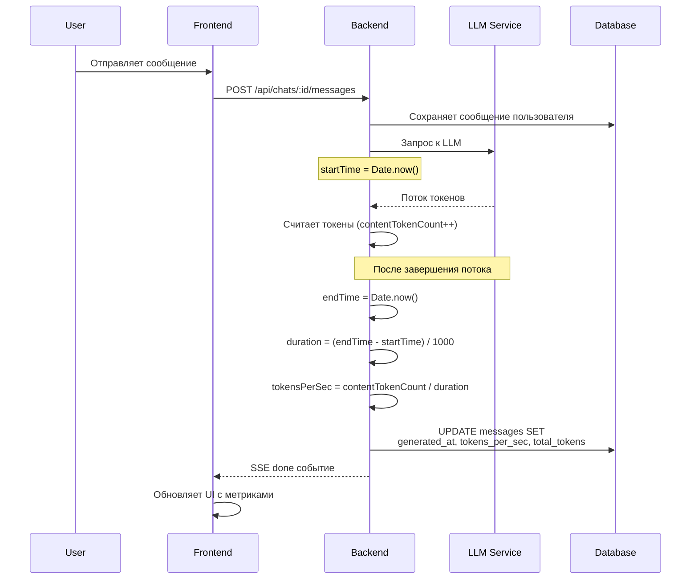

# План реализации панели статистики сообщений

## Анализ текущей структуры

### 1. Компоненты чата

| Компонент | Файл | Описание |
|-----------|------|----------|
| `MessageList` | [`client/src/components/chat/MessageList.tsx`](client/src/components/chat/MessageList.tsx) | Основной компонент отображения списка сообщений |
| `MessageItem` | [`client/src/components/chat/MessageList.tsx:32`](client/src/components/chat/MessageList.tsx:32) | Мемоизированный компонент для отображения одного сообщения |
| `MessageInput` | [`client/src/components/chat/MessageInput.tsx`](client/src/components/chat/MessageInput.tsx) | Компонент ввода сообщения |
| `StreamingResponse` | [`client/src/components/chat/StreamingResponse.tsx`](client/src/components/chat/StreamingResponse.tsx) | Компонент потоковой генерации ответа |

### 2. Структура данных сообщения

**Client-side тип** ([`client/src/types/index.ts:29`](client/src/types/index.ts:29)):
```typescript
export interface Message {
  id: number;
  chat_id: number;
  user_id: number;
  content: string;
  role: 'user' | 'assistant' | 'system';
  reasoning_content?: string;
  translated_content?: string | null;
  created_at: string;
}
```

**Server-side тип** ([`server/src/repositories/message.repository.ts:3`](server/src/repositories/message.repository.ts:3)):
```typescript
export interface Message {
  id: number;
  chat_id: number;
  role: string;
  content: string;
  translated_content: string | null;
  message_id: string | null;
  hidden: number;
  created_at: string;
}
```

### 3. Текущее отображение времени

Время отображается в [`MessageList.tsx:208-210`](client/src/components/chat/MessageList.tsx:208):
```tsx
<span className="text-xs text-gray-500">
  {formatMessageTime(message.created_at)}
</span>
```

Функция форматирования ([`MessageList.tsx:19`](client/src/components/chat/MessageList.tsx:19)):
```typescript
const formatMessageTime = (dateString: string): string => {
  const date = new Date(dateString);
  return date.toLocaleTimeString('ru-RU', {
    hour: '2-digit',
    minute: '2-digit',
    timeZone: Intl.DateTimeFormat().resolvedOptions().timeZone,
  });
};
```

### 4. Удаление сообщений

Удаление реализуется через:
- **Frontend**: [`ChatPage.tsx:270`](client/src/pages/ChatPage.tsx:270) - `handleDeleteMessage`
- **API**: [`chats.ts:253`](client/src/pages/ChatPage.tsx:253) - `handleRegenerate` (для перегенерации)
- **Backend**: [`messages.ts:118`](server/src/routes/messages.ts:118) - DELETE `/api/chats/:chatId/messages/:id`
- **Repository**: [`message.repository.ts:102`](server/src/repositories/message.repository.ts:102) - `deleteMessage`

### 5. Порядковый номер сообщения

**Текущее состояние**: Порядковый номер не хранится в БД и не вычисляется на frontend.

**Рекомендация**: Вычислять динамически на frontend на основе позиции сообщения в массиве `messages`, фильтруя только видимые сообщения (role !== 'system').

---

## План реализации

### Шаг 1: Создание миграции БД (Server-side)

**Файл**: `server/src/config/database.ts`

Добавить автоматическую миграцию при запуске сервера:

```typescript
/**
 * Выполнение миграций БД при запуске
 */
function runMigrations() {
  try {
    // Добавление колонок для статистики сообщений
    db.prepare(`
      ALTER TABLE messages ADD COLUMN generated_at TEXT;
    `).run();
    
    db.prepare(`
      ALTER TABLE messages ADD COLUMN tokens_per_sec REAL;
    `).run();
    
    db.prepare(`
      ALTER TABLE messages ADD COLUMN total_tokens INTEGER;
    `).run();
    
    console.log('[Database] Migrations completed successfully');
  } catch (error) {
    // Если колонки уже существуют, игнорируем ошибку
    if ((error as Error).message.includes('duplicate column')) {
      console.log('[Database] Columns already exist, skipping migration');
    } else {
      console.error('[Database] Migration error:', error);
    }
  }
}

// Вызвать миграции после создания таблицы
// (вместе с другими инициализациями)
```

**База данных**: `server/hometavern.db`

---

### Шаг 2: Расширение модели данных (Server-side)

**Файл**: `server/src/repositories/message.repository.ts`

Добавить новые поля в интерфейс `Message` и соответствующие параметры:

```typescript
export interface Message {
  id: number;
  chat_id: number;
  role: string;
  content: string;
  translated_content: string | null;
  message_id: string | null;
  hidden: number;
  created_at: string;
  generated_at?: string | null;    // Время окончания генерации
  tokens_per_sec?: number | null;   // Скорость генерации (токенов/сек)
  total_tokens?: number | null;     // Общее количество токенов
}

export interface UpdateMessageParams {
  role?: string;
  content?: string;
  translated_content?: string;
  message_id?: string;
  hidden?: number;
  generated_at?: string;
  tokens_per_sec?: number;
  total_tokens?: number;
}
```

Обновить метод `updateMessage` для обработки новых полей:

```typescript
updateMessage(id: number, updates: UpdateMessageParams): Message | undefined {
  const { role, content, translated_content, message_id, hidden, generated_at, tokens_per_sec, total_tokens } = updates;

  const stmt = db.prepare(`
    UPDATE messages
    SET role = COALESCE(?, role),
        content = COALESCE(?, content),
        translated_content = COALESCE(?, translated_content),
        message_id = COALESCE(?, message_id),
        hidden = COALESCE(?, hidden),
        generated_at = COALESCE(?, generated_at),
        tokens_per_sec = COALESCE(?, tokens_per_sec),
        total_tokens = COALESCE(?, total_tokens)
    WHERE id = ?
  `);
  stmt.run(
    role || null,
    content || null,
    translated_content !== undefined ? translated_content : null,
    message_id || null,
    hidden !== undefined ? hidden : null,
    generated_at !== undefined ? generated_at : null,
    tokens_per_sec !== undefined ? tokens_per_sec : null,
    total_tokens !== undefined ? total_tokens : null,
    id
  );

  return this.getMessageById(id);
}
```

---

### Шаг 3: Обновление LLM сервиса для сбора статистики (Server-side)

**Файл**: `server/src/services/llm.service.ts`

Необходимо модифицировать метод `generateStream` для сбора метрик. Метрики будут возвращены в финальном событии.

**Пример логики**:
```typescript
async * generateStream(userId: number, chatId: number, prompt: string) {
  const startTime = Date.now();
  let tokenCount = 0;
  
  for await (const chunk of stream) {
    tokenCount++;
    yield chunk;
  }
  
  const endTime = Date.now();
  const durationSecs = (endTime - startTime) / 1000;
  const tokensPerSec = durationSecs > 0 ? tokenCount / durationSecs : 0;
  
  // Сохранить метрики в глобальную переменную или вернуть через финальное событие
  // Метрики будут использованы в routes/chats.ts
}
```

---

### Шаг 4: Обновление роута streaming для сохранения статистики (Server-side)

**Файл**: `server/src/routes/chats.ts`

В обработчик `/api/chats/:chatId/stream`:
1. Отслеживать количество токенов
2. Замерять время начала и конца генерации
3. Обновить сообщение через `messageRepository.updateMessage` с метриками

```typescript
// В начале обработчика
let startTime = 0;
let contentTokenCount = 0;

// При первом токене
if (startTime === 0) startTime = Date.now();

// В цикле обработки потока (строка 136-143)
for await (const chunk of stream) {
  if (chunk.type === 'reasoning_token') {
    sendSSEEvent(res, 'reasoning_token', { token: chunk.token });
  } else if (chunk.type === 'content_token') {
    sendSSEEvent(res, 'content_token', { token: chunk.token });
    fullContent += chunk.token;
    contentTokenCount++;  // Считаем токены
  }
}

// После завершения потока (перед обновлением сообщения)
const endTime = Date.now();
const durationSecs = (endTime - startTime) / 1000;
const tokensPerSec = durationSecs > 0 ? contentTokenCount / durationSecs : 0;

// Обновить сообщение с метриками (вместо строки 160-163)
messageRepository.updateMessage(tempMessage.id, {
  content: fullContent,
  translated_content: translatedText !== fullContent ? translatedText : undefined,
  generated_at: new Date().toISOString(),
  tokens_per_sec: tokensPerSec,
  total_tokens: contentTokenCount
});
```

---

### Шаг 5: Обновление типов (Client-side)

**Файл**: `client/src/types/index.ts`

Расширить интерфейс `Message`:
```typescript
export interface Message {
  id: number;
  chat_id: number;
  user_id: number;
  content: string;
  role: 'user' | 'assistant' | 'system';
  reasoning_content?: string;
  translated_content?: string | null;
  created_at: string;
  // Новые поля для статистики
  generated_at?: string | null;
  tokens_per_sec?: number | null;
  total_tokens?: number | null;
}
```

---

### Шаг 6: Создание компонента MessageStatsPanel (Client-side)

**Файл**: `client/src/components/chat/MessageStatsPanel.tsx` (новый)

```tsx
import React from 'react';
import { Message } from '../../types';

interface MessageStatsPanelProps {
  message: Message;
  messageIndex: number;
}

export const MessageStatsPanel: React.FC<MessageStatsPanelProps> = ({
  message,
  messageIndex,
}) => {
  // Проверяем, что сообщение имеет метрики (только assistant)
  const stats = message as Message & { 
    generated_at?: string | null;
    tokens_per_sec?: number | null;
    total_tokens?: number | null;
  };
  
  if (!stats.tokens_per_sec && !stats.total_tokens) {
    return null;
  }
  
  // Вычисляем порядковый номер (исключая system сообщения)
  // Это будет сделано на уровне родителя, передаем как prop
  const messageNumber = messageIndex + 1;
  
  // Форматируем время отправки
  const sendTime = new Date(message.created_at).toLocaleTimeString('ru-RU', {
    hour: '2-digit',
    minute: '2-digit',
  });
  
  // Вычисляем время генерации
  let generationTime: string | null = null;
  if (stats.generated_at && message.created_at) {
    const genTime = (new Date(stats.generated_at).getTime() - new Date(message.created_at).getTime()) / 1000;
    generationTime = genTime.toFixed(2);
  }
  
  return (
    <div className="mt-2 pt-2 border-t border-gray-600/50">
      <div className="flex items-center gap-4 text-xs text-gray-500 flex-wrap">
        {/* Порядковый номер */}
        <span className="font-medium text-gray-400">#{messageNumber}</span>
        
        {/* Время отправки */}
        <span>🕐 {sendTime}</span>
        
        {/* Количество токенов */}
        {stats.total_tokens && (
          <span>📝 {stats.total_tokens} ток.</span>
        )}
        
        {/* Скорость генерации */}
        {stats.tokens_per_sec && (
          <span>⚡ {stats.tokens_per_sec.toFixed(1)} ток/сек</span>
        )}
        
        {/* Время генерации */}
        {generationTime && (
          <span>⏱️ {generationTime}с</span>
        )}
      </div>
    </div>
  );
};
```

---

### Шаг 7: Интеграция MessageStatsPanel в MessageList

**Файл**: `client/src/components/chat/MessageList.tsx`

1. Импортировать компонент:
```typescript
import { MessageStatsPanel } from './MessageStatsPanel';
```

2. В компоненте `MessageItem` добавить пропс `messageIndex`:
```typescript
const MessageItem = memo(({
  message,
  onRegenerate,
  onEdit,
  onDelete,
  showThinking,
  onToggleThinking,
  translatingMessageId,
  onTranslate,
  isLastAssistantMessage,
  messageIndex,  // Добавить новый prop
}: {
  // ... существующие props
  messageIndex: number;  // Добавить тип
}) => {
  // ... существующий код
```

3. После рендера контента сообщения (после строки 199) добавить:
```tsx
{/* Message stats panel - только для assistant сообщений с метриками */}
{message.role === 'assistant' && (message as Message & { tokens_per_sec?: number | null }).tokens_per_sec !== undefined && (
  <MessageStatsPanel
    message={message}
    messageIndex={messageIndex}
  />
)}
```

4. В рендере списка передать `index`:
```tsx
{messages.map((message, index) => {
  const isLastAssistantMessage = index === lastAssistantMessageIndex && message.role === 'assistant';
  return (
    <MessageItem
      key={message.id}
      message={message}
      onRegenerate={onRegenerate}
      onEdit={onEdit}
      onDelete={onDelete}
      showThinking={showThinking}
      onToggleThinking={onToggleThinking}
      translatingMessageId={translatingMessageId}
      onTranslate={onTranslate}
      isLastAssistantMessage={isLastAssistantMessage}
      messageIndex={index}  // Добавить
    />
  );
})}
```

---

## Архитектурная схема



---

## Структура UI панели статистики

```
┌─────────────────────────────────────────────────────────┐
│  Сообщение ассистента                                   │
│  (bubble с контентом)                                   │
│                                                         │
│  Привет! Как я могу помочь тебе сегодня?               │
└─────────────────────────────────────────────────────────┘
│ #1  🕐 14:32  📝 8 ток.  ⚡ 4.2 ток/сек  ⏱️ 1.90с      │
└─────────────────────────────────────────────────────────┘
│ [RU] [Copy] [Edit] [Delete]                            │
└─────────────────────────────────────────────────────────┘
```

---

## Зависимости

| Компонент | Зависит от |
|-----------|------------|
| MessageStatsPanel | Message type (с новыми полями) |
| Интеграция в MessageList | MessageStatsPanel |
| Сбор метрик на сервере | LLM service модификация |
| Сохранение метрик | Message repository update |
| Миграция БД | database.ts |

---

## Примечания

1. **Порядковый номер**: Вычисляется динамически на frontend (index + 1), не хранится в БД
2. **Время отправки**: Уже есть в `created_at`, просто переносим отображение
3. **Метрики генерации**: Только для assistant сообщений (только сгенерированные ИИ)
4. **Производительность**: Компонент MessageStatsPanel должен быть мемоизирован
5. **Миграция БД**: Автоматическая при запуске сервера, безопасная (не удаляет данные)
