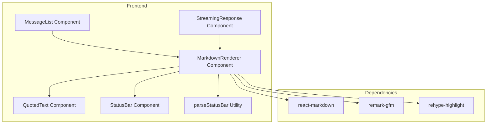
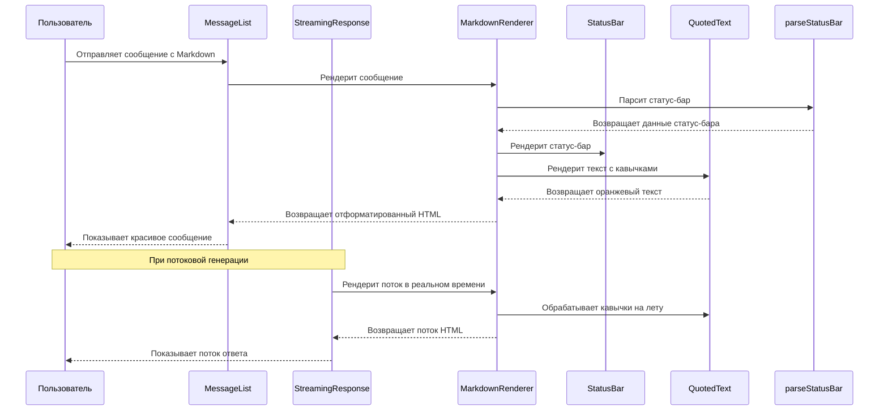

# План улучшения чата: Markdown, цитаты и статус-бар

## Обзор задачи

Необходимо улучшить читаемость и визуальное оформление чата в HomeTavern V5:

1. **Полная поддержка Markdown** - в ответах пользователя, ИИ и при потоковой генерации
2. **Подсветка текста в кавычках** - оранжевым цветом для лучшей читаемости ("текст", «текст», „текст")
3. **Красивый статус-бар** - форматирование статус-бара с эмодзи и тёмным блоком

---

## Архитектура решения



---

## 1. Установка зависимостей

### Необходимые пакеты

```bash
cd client
npm install react-markdown remark-gfm rehype-highlight rehype-stringify remark-math katex
npm install --save-dev @types/rehype-stringify
```

**Описание пакетов:**
- `react-markdown` - рендеринг Markdown в React компоненты
- `remark-gfm` - поддержка GitHub Flavored Markdown (таблицы, зачеркнутый текст, задачи)
- `rehype-highlight` - подсветка синтаксиса кода
- `remark-math` - поддержка математических формул
- `katex` - рендеринг математических формул

---

## 2. Компонент QuotedText

### Назначение
Обнаруживает текст в кавычках и оборачивает его в `<span>` с оранжевым цветом.

### Поддерживаемые типы кавычек
- Английские: `"текст"`
- Русские прямые: «текст»
- Русские книжные: „текст"

### Реализация

```tsx
// client/src/components/common/QuotedText.tsx
import React from 'react';

interface QuotedTextProps {
  text: string;
}

export const QuotedText: React.FC<QuotedTextProps> = ({ text }) => {
  // Регулярное выражение для поиска текста в кавычках
  const quotePattern = /(["""]|«|»|„)([^""]+?)\1/g;
  
  const parts = text.split(quotePattern);
  
  return (
    <>
      {parts.map((part, index) => {
        // Чётные индексы - текст вне кавычек, нечётные - кавычки, следующие - контент
        if (index % 3 === 1) {
          // Это кавычка - сохраняем её
          return <span key={index}>{part}</span>;
        } else if (index % 3 === 2) {
          // Это контент в кавычках - оранжевый цвет
          return (
            <span key={index} className="text-orange-400 font-medium">
              {part}
            </span>
          );
        } else {
          // Обычный текст
          return <span key={index}>{part}</span>;
        }
      })}
    </>
  );
};
```

---

## 3. Компонент StatusBar

### Назначение
Форматирует статус-бар из сырого текста в красивый тёмный блок с эмодзи.

### Шаблон статус-бара
```
[Calendar: {DD.MM.YYYY HH:MM Day of Week} | Weather: {Condition} | Location: {Place Name} | NPCs nearby: {Names}]
```

### Логика парсинга
1. Ищем паттерн `[... | ... | ... | ...]` в начале текста
2. Разбиваем содержимое по ` | ` (пробел-вертикальная черта-пробел)
3. Проверяем, что есть ровно 4 части (структура фиксированная)
4. Каждая часть имеет формат `Label: Value`, где `Label` - любое слово/фраза до двоеточия
5. Форматируем каждую часть с соответствующим эмодзи по позиции:
   - Часть 1 (индекс 0): 📅
   - Часть 2 (индекс 1): 🌤️
   - Часть 3 (индекс 2): 📍
   - Часть 4 (индекс 3): 👥

### Эмодзи для каждого элемента
| Элемент | Эмодзи |
|---------|--------|
| Calendar | 📅 |
| Weather | 🌤️ |
| Location | 📍 |
| NPCs nearby | 👥 |

### Реализация

```tsx
// client/src/components/common/StatusBar.tsx
import React from 'react';

interface StatusBarProps {
  calendar: string;
  weather: string;
  location: string;
  npcs: string;
}

export const StatusBar: React.FC<StatusBarProps> = ({ 
  calendar, 
  weather, 
  location, 
  npcs 
}) => {
  return (
    <div className="w-full bg-gray-800/80 rounded-lg px-4 py-2 mb-4 border border-gray-700">
      <div className="flex flex-wrap items-center justify-center gap-4 text-sm">
        <span className="flex items-center gap-1.5">
          <span className="text-lg">📅</span>
          <span className="text-gray-200">{calendar}</span>
        </span>
        <span className="text-gray-600">|</span>
        <span className="flex items-center gap-1.5">
          <span className="text-lg">🌤️</span>
          <span className="text-gray-200">{weather}</span>
        </span>
        <span className="text-gray-600">|</span>
        <span className="flex items-center gap-1.5">
          <span className="text-lg">📍</span>
          <span className="text-gray-200">{location}</span>
        </span>
        <span className="text-gray-600">|</span>
        <span className="flex items-center gap-1.5">
          <span className="text-lg">👥</span>
          <span className="text-gray-200">{npcs}</span>
        </span>
      </div>
    </div>
  );
};
```

### Утилита парсинга

```typescript
// client/src/utils/statusBar.ts
export interface StatusBarData {
  calendar: string;
  weather: string;
  location: string;
  npcs: string;
}

/**
 * Парсит статус-бар из текста
 * Возвращает объект с данными или null если формат не распознан
 *
 * Формат: [Label1: Value1 | Label2: Value2 | Label3: Value3 | Label4: Value4]
 * Ориентируется только на структуру, не на конкретные слова
 */
export function parseStatusBar(text: string): StatusBarData | null {
  // Ищем паттерн [...] в начале текста
  const match = text.match(/^\[([^\]]+)\]/);
  if (!match) return null;
  
  const content = match[1];
  // Разбиваем по " | " (пробел-вертикальная черта-пробел)
  const parts = content.split(/\s*\|\s*/);
  
  // Должно быть ровно 4 части
  if (parts.length !== 4) return null;
  
  // Парсим каждую часть: берем всё после первого двоеточия
  const parsePart = (part: string): string => {
    const colonIndex = part.indexOf(':');
    if (colonIndex === -1) return part.trim();
    return part.substring(colonIndex + 1).trim();
  };
  
  return {
    calendar: parsePart(parts[0]),
    weather: parsePart(parts[1]),
    location: parsePart(parts[2]),
    npcs: parsePart(parts[3]),
  };
}

/**
 * Извлекает статус-бар из текста и возвращает { statusBar, content }
 */
export function extractStatusBar(text: string): { 
  statusBar: StatusBarData | null; 
  content: string; 
} {
  const parsed = parseStatusBar(text);
  if (!parsed) {
    return { statusBar: null, content: text };
  }
  
  // Удаляем статус-бар из начала текста
  const content = text.replace(/^\[[^\]]+\]\s*/, '');
  return { statusBar: parsed, content };
}
```

---

## 4. Компонент MarkdownRenderer

### Назначение
Объединяет Markdown-рендеринг, подсветку цитат и статус-бар в один компонент.

### Реализация

```tsx
// client/src/components/common/MarkdownRenderer.tsx
import React, { useState, useEffect } from 'react';
import ReactMarkdown from 'react-markdown';
import remarkGfm from 'remark-gfm';
import rehypeHighlight from 'rehype-highlight';
import { extractStatusBar } from '../../utils/statusBar';
import { StatusBar } from './StatusBar';
import { QuotedText } from './QuotedText';

interface MarkdownRendererProps {
  children: string;
  streaming?: boolean;
}

export const MarkdownRenderer: React.FC<MarkdownRendererProps> = ({ 
  children, 
  streaming = false 
}) => {
  const [statusBar, setStatusBar] = useState<any>(null);
  const [content, setContent] = useState(children);
  
  useEffect(() => {
    // Парсим статус-бар при изменении контента
    const { statusBar: parsedStatusBar, content: extractedContent } = extractStatusBar(children);
    setStatusBar(parsedStatusBar);
    setContent(extractedContent);
  }, [children]);
  
  return (
    <div className="markdown-content">
      {statusBar && <StatusBar {...statusBar} />}
      <ReactMarkdown
        remarkPlugins={[remarkGfm]}
        rehypePlugins={[rehypeHighlight]}
        components={{
          // Обертка для текста - обрабатываем кавычки
          p: ({ children }) => (
            <p className="mb-4 last:mb-0">
              <QuotedText text={Array.isArray(children) ? children.join('') : children} />
            </p>
          ),
          // Подсветка кода
          code: ({ className, children, ...props }) => {
            const match = /language-(\w+)/.exec(className || '');
            return match ? (
              <pre className="bg-gray-900 p-4 rounded-lg overflow-x-auto my-4">
                <code className={className} {...props}>
                  {children}
                </code>
              </pre>
            ) : (
              <code className="bg-gray-800 px-2 py-1 rounded text-sm">
                {children}
              </code>
            );
          },
          // Заголовки
          h1: ({ children }) => <h1 className="text-2xl font-bold mb-4 mt-6">{children}</h1>,
          h2: ({ children }) => <h2 className="text-xl font-bold mb-3 mt-5">{children}</h2>,
          h3: ({ children }) => <h3 className="text-lg font-bold mb-2 mt-4">{children}</h3>,
          // Списки
          ul: ({ children }) => <ul className="list-disc list-inside mb-4 ml-4">{children}</ul>,
          ol: ({ children }) => <ol className="list-decimal list-inside mb-4 ml-4">{children}</ol>,
          li: ({ children }) => <li className="mb-1">{children}</li>,
          // Таблицы
          table: ({ children }) => (
            <div className="overflow-x-auto my-4">
              <table className="min-w-full border border-gray-700">{children}</table>
            </div>
          ),
          th: ({ children }) => (
            <th className="border border-gray-700 px-4 py-2 bg-gray-800 font-bold">{children}</th>
          ),
          td: ({ children }) => (
            <td className="border border-gray-700 px-4 py-2">{children}</td>
          ),
          // Цитаты
          blockquote: ({ children }) => (
            <blockquote className="border-l-4 border-blue-500 pl-4 py-2 my-4 bg-gray-800/50 italic text-gray-300">
              {children}
            </blockquote>
          ),
          // Горизонтальная линия
          hr: () => <hr className="my-4 border-gray-700" />,
          // Ссылки
          a: ({ href, children }) => (
            <a href={href} className="text-blue-400 hover:text-blue-300 underline" target="_blank" rel="noopener noreferrer">
              {children}
            </a>
          ),
        }}
      >
        {content}
      </ReactMarkdown>
    </div>
  );
};
```

---

## 5. Обновление MessageList.tsx

### Изменения
1. Импортировать `MarkdownRenderer`
2. Заменить простой вывод текста на `MarkdownRenderer`
3. Обработать статус-бар в системных сообщениях

```tsx
// В MessageList.tsx
import { MarkdownRenderer } from '../components/common/MarkdownRenderer';

// В рендере сообщения:
{isEditing ? (
  // ... редактирование ...
) : (
  <div className="whitespace-pre-wrap">
    <MarkdownRenderer>
      {message.role === 'assistant' && message.translated_content 
        ? (showOriginal[message.id] ? message.content : message.translated_content)
        : message.content
      }
    </MarkdownRenderer>
  </div>
)}
```

---

## 6. Обновление StreamingResponse.tsx

### Изменения
1. Импортировать `MarkdownRenderer`
2. Использовать `MarkdownRenderer` для потокового контента
3. Обрабатывать статус-бар в реальном времени

```tsx
// В StreamingResponse.tsx
import { MarkdownRenderer } from '../components/common/MarkdownRenderer';

// В рендере:
<MarkdownRenderer streaming>
  {content}
</MarkdownRenderer>
```

---

## 7. Стили Tailwind

### Добавить в `client/src/index.css`

```css
/* Markdown content styles */
.markdown-content {
  @apply text-white;
}

.markdown-content p {
  @apply mb-4 last:mb-0;
}

.markdown-content code {
  @apply bg-gray-800 px-2 py-1 rounded text-sm font-mono;
}

.markdown-content pre code {
  @apply bg-transparent p-0;
}

.markdown-content pre {
  @apply bg-gray-900 p-4 rounded-lg overflow-x-auto my-4;
}

.markdown-content h1 {
  @apply text-2xl font-bold mb-4 mt-6;
}

.markdown-content h2 {
  @apply text-xl font-bold mb-3 mt-5;
}

.markdown-content h3 {
  @apply text-lg font-bold mb-2 mt-4;
}

.markdown-content ul {
  @apply list-disc list-inside mb-4 ml-4;
}

.markdown-content ol {
  @apply list-decimal list-inside mb-4 ml-4;
}

.markdown-content table {
  @apply w-full border border-gray-700;
}

.markdown-content th {
  @apply border border-gray-700 px-4 py-2 bg-gray-800 font-bold;
}

.markdown-content td {
  @apply border border-gray-700 px-4 py-2;
}

.markdown-content blockquote {
  @apply border-l-4 border-blue-500 pl-4 py-2 my-4 bg-gray-800/50 italic text-gray-300;
}

.markdown-content a {
  @apply text-blue-400 hover:text-blue-300 underline;
}
```

---

## 8. Диаграмма потока данных



---

## 9. План реализации

### Этап 1: Подготовка
- [ ] Установить зависимости
- [ ] Создать базовую структуру компонентов

### Этап 2: Базовые компоненты
- [ ] Создать `QuotedText` компонент
- [ ] Создать `StatusBar` компонент
- [ ] Создать `parseStatusBar` утилиту

### Этап 3: Основной рендерер
- [ ] Создать `MarkdownRenderer` компонент
- [ ] Настроить ReactMarkdown с плагинами
- [ ] Добавить стили Tailwind

### Этап 4: Интеграция
- [ ] Обновить `MessageList.tsx`
- [ ] Обновить `StreamingResponse.tsx`
- [ ] Протестировать потоковую генерацию

### Этап 5: Полировка
- [ ] Добавить обработку ошибок
- [ ] Оптимизировать производительность
- [ ] Добавить тесты

---

## 10. Примечания

### Важные моменты
1. **Порядок элементов статус-бара не меняется**, но перевод может менять слова "Calendar", "Weather" и т.д. на русский. Поэтому парсинг должен ориентироваться на символы `[ : | : | : | : ]`, а не на конкретные слова.

2. **Потоковая генерация** - статус-бар должен быть в начале сообщения, поэтому он парсится из первого чанка и сохраняется.

3. **Производительность** - при потоковой генерации не нужно перепарсить статус-бар каждый раз, только при первом чанке.

4. **Кавычки** - регулярное выражение должно поддерживать все типы кавычек: `"`, `"`, `«`, `»`, `„`.

---

## Заключение

Этот план обеспечивает полную поддержку Markdown, красивую подсветку цитат и форматирование статус-бара. Все компоненты модульные и могут быть протестированы независимо.
