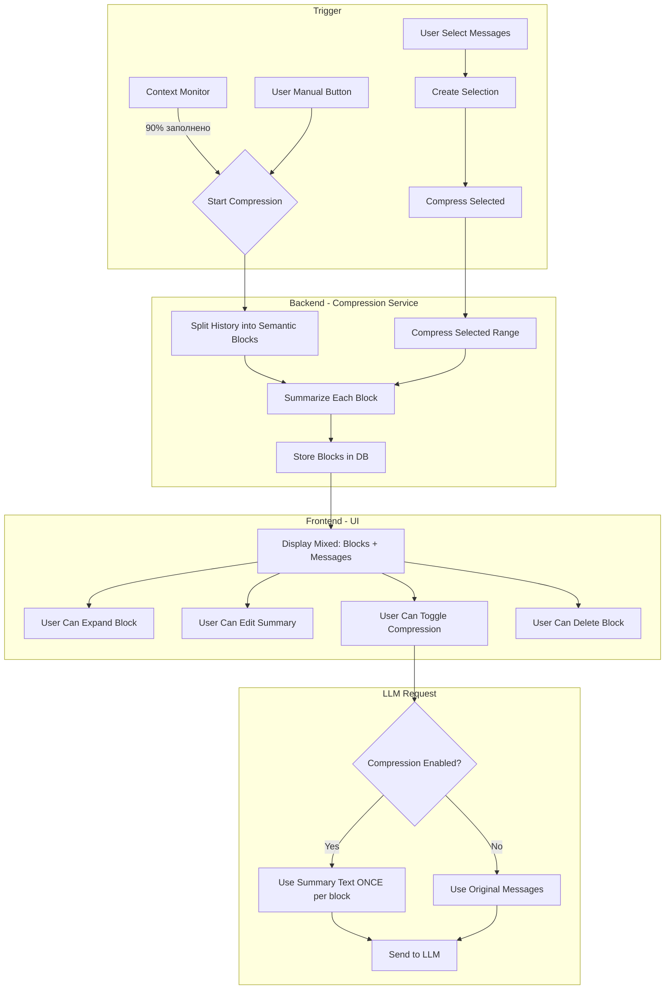
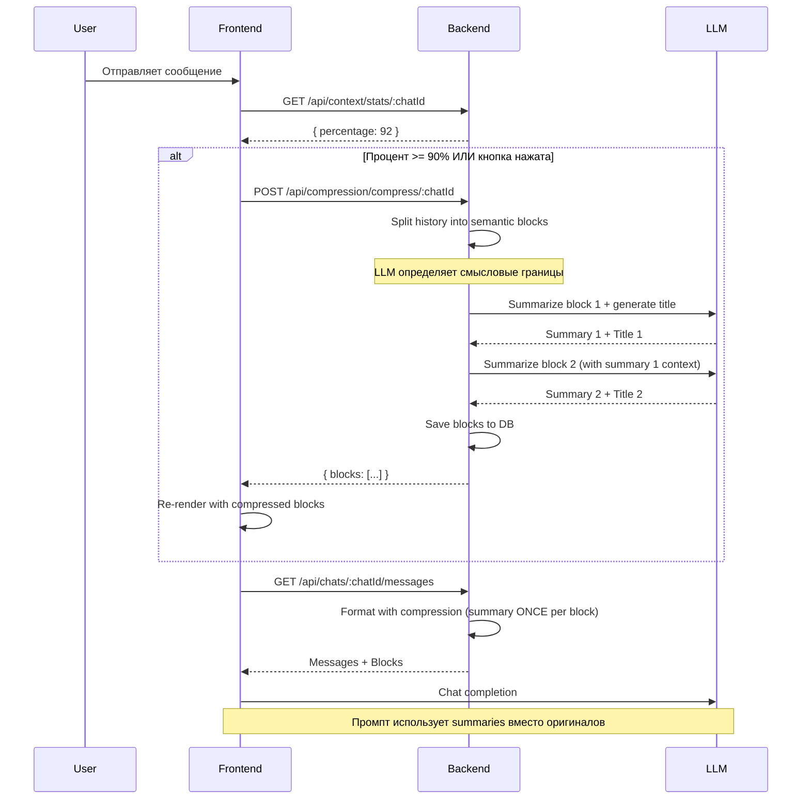

# Архитектура: Умное сжатие истории

## Описание функциональности

"Умное сжатие истории" — это система автоматического сжатия длинных диалогов с помощью LLM для экономии токенов контекста.

### Ключевые возможности:
1. **Автоматический запуск** при достижении 90% заполнения контекста + **ручная кнопка** для принудительного сжатия
2. **Разбивка истории на блоки** (главы) по смыслу (сохранение целостности и смысла)
3. **Краткий пересказ каждого блока** с учётом предыдущих пересказов
4. **Возможность редактирования** кратких пересказов и заголовков
5. **Кнопка "разжать"** для временного отключения сжатия на конкретном блоке
6. **Визуальное отображение** в чате в виде стилизованных глав
7. **Выделение сообщений вручную** для выбора секции сжатия
8. **Откат сжатия** последнего блока
9. **Сохранение порядка** — чередование сжатых блоков и обычных сообщений

---

## Архитектура системы



---

## Структура данных

### Таблица `chat_blocks`

Новая таблица в SQLite для хранения блоков сжатия истории:

```sql
CREATE TABLE chat_blocks (
    id INTEGER PRIMARY KEY AUTOINCREMENT,
    chat_id INTEGER NOT NULL,
    title TEXT NOT NULL,              -- Заголовок блока (главы)
    summary TEXT NOT NULL,            -- Краткий пересказ блока
    original_message_ids TEXT NOT NULL, -- JSON массив ID оригинальных сообщений
    start_message_id INTEGER,         -- ID первого сообщения в блоке
    end_message_id INTEGER,           -- ID последнего сообщения в блоке
    is_compressed INTEGER DEFAULT 1,  -- Флаг: использовать сжатие (1) или оригинал (0)
    sort_order INTEGER NOT NULL,      -- Порядок блоков в истории
    created_at TEXT NOT NULL,         -- ISO 8601 UTC формат
    updated_at TEXT NOT NULL,
    FOREIGN KEY (chat_id) REFERENCES chats(id) ON DELETE CASCADE
);

-- Индекс для быстрого поиска по chat_id
CREATE INDEX idx_chat_blocks_chat_id ON chat_blocks(chat_id);
```

**Пояснения:**
- `original_message_ids` — JSON строка с массивом ID сообщений, входящих в блок (ссылки на существующие сообщения в БД)
- `is_compressed` — позволяет временно отключить сжатие для конкретного блока
- `sort_order` — порядок отображения блоков (важно для восстановления последовательности)
- **Оригинальные сообщения НЕ удаляются** из таблицы `messages`, только ссылаются на них

### Таблица `messages` — без изменений

Оригинальные сообщения остаются в таблице `messages`. Блоки только ссылаются на них через `original_message_ids`.

---

## Порядок отображения в чате

### Проблема:
Нужно поддерживать чередование: сжатый блок → обычные сообщения → сжатый блок → ...

### Решение:
Используем `sort_order` в `chat_blocks` и объединяем с обычными сообщениями:

```typescript
// Алгоритм рендера в MessageList
type RenderItem = 
  | { type: 'message'; message: Message }
  | { type: 'block'; block: ChatBlock };

function buildRenderItems(messages: Message[], blocks: ChatBlock[]): RenderItem[] {
  const items: RenderItem[] = [];
  const processedMessageIds = new Set<number>();

  // Проходим по блокам в порядке sort_order
  for (const block of blocks) {
    // Добавляем обычные сообщения до этого блока
    // (те, что не входят ни в один блок и имеют id < block.start_message_id)
    
    // Добавляем сам блок
    items.push({ type: 'block', block });
    
    // Помечаем сообщения блока как обработанные
    block.original_message_ids.forEach(id => processedMessageIds.add(id));
  }

  // Добавляем оставшиеся сообщения после последнего блока
  // (те, что не входят ни в один блок)

  return items;
}
```

**Важно:** При формировании промпта для LLM:
- Для каждого сжатого блока добавляем **один раз** текст `summary`
- Для обычных сообщений добавляем их как есть

---

## Backend Архитектура

### 1. Новый репозиторий: `chat_block.repository.ts`

```typescript
export interface ChatBlock {
  id: number;
  chat_id: number;
  title: string;
  summary: string;
  original_message_ids: string;  // JSON string: "[1, 2, 3]"
  start_message_id: number | null;
  end_message_id: number | null;
  is_compressed: number;  // 0 or 1
  sort_order: number;
  created_at: string;
  updated_at: string;
}

export interface CreateChatBlockParams {
  chat_id: number;
  title: string;
  summary: string;
  original_message_ids: number[];  // Array of message IDs
  start_message_id?: number | null;
  end_message_id?: number | null;
  sort_order: number;
}

export interface UpdateChatBlockParams {
  title?: string;
  summary?: string;
  is_compressed?: number;
  sort_order?: number;
}

export class ChatBlockRepository {
  getBlocksByChatId(chatId: number): ChatBlock[];
  getBlockById(id: number): ChatBlock | undefined;
  createBlock(params: CreateChatBlockParams): ChatBlock;
  updateBlock(id: number, params: UpdateChatBlockParams): ChatBlock | undefined;
  deleteBlock(id: number): boolean;
  deleteBlocksByChatId(chatId: number): boolean;
  
  // Получить последний блок для отката
  getLastBlock(chatId: number): ChatBlock | undefined;
}
```

### 2. Новый сервис: `compression.service.ts`

```typescript
/**
 * Compression Service - Умное сжатие истории
 * 
 * Основные функции:
 * 1. Анализ истории и разбивка на семантические блоки
 * 2. Генерация кратких пересказов для каждого блока
 * 3. Интеграция с LLM для суммаризации
 * 4. Поддержка ручного выделения сообщений
 */

export interface CompressionBlock {
  title: string;
  summary: string;
  messageIds: number[];
  startMessageId: number;
  endMessageId: number;
}

export interface CompressionOptions {
  maxBlockMessages?: number;    // Максимальное количество сообщений в блоке (эвристика)
  summaryTemperature?: number;  // Temperature для генерации пересказа
}

export interface CompressionResult {
  blocks: ChatBlock[];
  originalCount: number;        // Количество оригинальных сообщений
  compressedCount: number;      // Количество сжатых блоков
  tokenSavings: number;         // Примерная экономия токенов
}

export class CompressionService {
  /**
   * Автоматическое сжатие истории чата
   * Запускается при достижении 90% контекста
   */
  async compressChat(
    chatId: number,
    userId: number,
    options?: CompressionOptions
  ): Promise<CompressionResult>;

  /**
   * Ручное сжатие выделенного диапазона сообщений
   */
  async compressSelectedRange(
    chatId: number,
    userId: number,
    startMessageId: number,
    endMessageId: number
  ): Promise<ChatBlock>;

  /**
   * Разбивка истории на семантические блоки
   * Использует LLM для определения смысловых границ
   */
  private splitIntoSemanticBlocks(
    messages: Message[],
    character: Character,
    options: CompressionOptions
  ): Promise<Block[]>;

  /**
   * Генерация краткого пересказа для блока
   * Учитывает предыдущие пересказы для контекста
   * Генерирует заголовок автоматически на основе содержания
   */
  private generateBlockSummary(
    block: Block,
    previousSummaries: string[],
    character: Character,
    heroProfile: string | null
  ): Promise<CompressionBlock>;

  /**
   * Откат последнего сжатия (удаление последнего блока)
   */
  async undoLastCompression(chatId: number): Promise<boolean>;

  /**
   * Проверка необходимости сжатия
   * Возвращает true если контекст заполнен более чем на 90%
   */
  async needsCompression(chatId: number, userId: number): Promise<boolean>;
}
```

### 3. Обновление `llm.service.ts`

Изменение формата отправки сообщений в LLM:

```typescript
/**
 * Форматирование истории с учётом сжатых блоков
 * ВАЖНО: summary добавляется ОДИН РАЗ для каждого блока
 */
export function formatMessagesForQwenWithCompression(
  character: any,
  heroProfile: string | null,
  heroName: string | null,
  historyMessages: any[],
  currentMessage: string,
  compressedBlocks: ChatBlock[]  // Новые параметры
): LLMMessage[] {
  const messages: LLMMessage[] = [];
  const processedMessageIds = new Set<number>();

  // 1. Системный промпт персонажа (как раньше)
  // ...

  // 2. Проходим по истории
  for (const msg of historyMessages) {
    if (msg.hidden) continue;

    // Проверяем, входит ли сообщение в сжатый блок
    const block = compressedBlocks.find(b => 
      b.original_message_ids.includes(msg.id)
    );

    if (block) {
      // Если это первое сообщение блока (start_message_id), добавляем summary
      if (msg.id === block.start_message_id && block.is_compressed === 1) {
        messages.push({
          role: 'system',
          content: `[Сжатая история: ${block.title}]\n${block.summary}`
        });
      }
      // Пропускаем остальные сообщения блока (они уже в summary)
      continue;
    }

    // Если сообщение не в блоке, добавляем как обычно
    messages.push({ role: msg.role, content: msg.content });
  }

  // 3. Текущее сообщение
  // ...

  return messages;
}
```

### 4. Новые API Endpoints

#### `server/src/routes/compression.ts`

```typescript
/**
 * Compression API Endpoints
 */

// POST /api/compression/compress/:chatId
// Запустить сжатие истории для чата (автоматический режим)
// Response: { success: boolean, blocks: ChatBlock[], originalCount: number, summaryCount: number }

// POST /api/compression/compress-selected/:chatId
// Запустить сжатие выделенного диапазона
// Body: { startMessageId: number, endMessageId: number }
// Response: { success: boolean, block: ChatBlock }

// GET /api/compression/blocks/:chatId
// Получить все блоки сжатия для чата
// Response: ChatBlock[]

// PUT /api/compression/block/:id
// Обновить блок (редактирование summary, включение/выключение сжатия)
// Body: { title?: string, summary?: string, is_compressed?: boolean }
// Response: ChatBlock

// DELETE /api/compression/block/:id
// Удалить блок сжатия
// Response: { success: boolean }

// POST /api/compression/undo/:chatId
// Откатить последнее сжатие (удалить последний блок)
// Response: { success: boolean }

// DELETE /api/compression/reset/:chatId
// Сбросить все блоки сжатия для чата (восстановить полную историю)
// Response: { success: boolean }

// GET /api/compression/needs/:chatId
// Проверить необходимость сжатия
// Response: { needsCompression: boolean, percentage: number }
```

---

## Frontend Архитектура

### 1. Новый тип: `types/compression.ts`

```typescript
export interface ChatBlock {
  id: number;
  chat_id: number;
  title: string;
  summary: string;
  original_message_ids: number[];
  start_message_id: number | null;
  end_message_id: number | null;
  is_compressed: boolean;
  sort_order: number;
  created_at: string;
  updated_at: string;
}

export interface CompressionStats {
  originalMessageCount: number;
  compressedBlockCount: number;
  tokenSavings: number;
  percentage: number;
}

export interface MessageSelection {
  startMessageId: number;
  endMessageId: number;
}
```

### 2. Новый компонент: `ChatBlock.tsx`

```tsx
/**
 * ChatBlock - Компонент отображения сжатого блока истории
 * 
 * Функциональность:
 * - Отображение краткого пересказа в стиле сообщения
 * - Кнопка "Развернуть" для просмотра оригинальных сообщений
 * - Кнопка "Редактировать" для изменения summary (открывает модальное окно)
 * - Переключатель "Сжатие вкл/выкл"
 * - Кнопка "Удалить блок"
 */

interface ChatBlockProps {
  block: ChatBlock;
  messages: Message[];  // Оригинальные сообщения блока
  onEdit: (blockId: number, updates: { title?: string; summary?: string }) => void;
  onToggleCompression: (blockId: number, isCompressed: boolean) => void;
  onDelete: (blockId: number) => void;
}
```

### 2.1. Модальное окно редактирования блока: `EditBlockModal.tsx`

```tsx
/**
 * EditBlockModal - Модальное окно для редактирования заголовка и краткого пересказа
 * 
 * Функциональность:
 * - Поле ввода для заголовка (текстовое поле)
 * - Поле ввода для краткого пересказа (textarea с авто-увеличением)
 * - Кнопки "Сохранить" и "Отмена"
 * - Валидация: заголовок обязателен, summary не пустой
 */

interface EditBlockModalProps {
  block: ChatBlock;
  onSave: (blockId: number, updates: { title: string; summary: string }) => void;
  onCancel: () => void;
}

// UI макет:
/*
┌─────────────────────────────────────────────────┐
│ ✏️ Редактирование блока                  [X]    │
├─────────────────────────────────────────────────┤
│                                                 │
│ Заголовок:                                      │
│ ┌─────────────────────────────────────────────┐ │
│ │ Глава 1: Знакомство с персонажем           │ │
│ └─────────────────────────────────────────────┘ │
│                                                 │
│ Краткий пересказ:                               │
│ ┌─────────────────────────────────────────────┐ │
│ │ Пользователь встретился с персонажем в     │ │
│ │ таверне и начал диалог. Персонаж           │ │
│ │ представился и рассказал о себе...         │ │
│ │                                             │ │
│ │ (textarea с авто-увеличением)              │ │
│ └─────────────────────────────────────────────┘ │
│                                                 │
│                    [Отмена]  [Сохранить]        │
└─────────────────────────────────────────────────┘
*/
```

**Логика работы:**

1. **Открытие модального окна** — клик по кнопке "✏️" в `ChatBlock`
2. **Предзагрузка данных** — текущие `title` и `summary` загружаются в поля
3. **Редактирование** — пользователь может изменить заголовок и/или summary
4. **Сохранение** — вызывается `onEdit(blockId, { title, summary })`
5. **Отмена** — модальное окно закрывается без изменений

**Валидация:**
- Заголовок — обязательное поле, не пустой
- Summary — обязательное поле, не пустой
- Максимальная длина заголовка: 100 символов
- Максимальная длина summary: 2000 символов

**Визуальный дизайн:**
```
┌─────────────────────────────────────────────────┐
│ 📚 Глава 1: Знакомство с персонажем            │
│ [✏️] [🔄 Сжатие: ВКЛ] [🗑️]                     │
│                                                 │
│ Краткий пересказ:                               │
│ Пользователь встретился с персонажем в таверне │
│ и начал диалог. Персонаж представился...       │
│                                                 │
│ [▼ Развернуть оригинальные сообщения (5)]       │
└─────────────────────────────────────────────────┘
```

### 3. Новая кнопка для ручного запуска

Добавить кнопку над списком сообщений:

```tsx
<div className="flex justify-center py-2">
  <button
    onClick={handleManualCompress}
    disabled={isCompressing}
    className="px-4 py-2 bg-cyan-600 hover:bg-cyan-500 rounded-lg text-sm font-medium transition disabled:opacity-50"
  >
    {isCompressing ? 'Сжатие...' : '🗜️ Сжать историю'}
  </button>
</div>
```

### 4. Выделение сообщений для ручного сжатия

**Процесс выделения:**

1. **Кнопка "Ручное сжатие"** — отдельная кнопка над чатом
2. **Выбор первого сообщения** — клик по сообщению устанавливает `startMessageId`
3. **Выбор последнего сообщения** — клик по другому сообщению устанавливает `endMessageId`
4. **Модальное окно подтверждения** — показывает диапазон и количество сообщений
5. **Подтверждение** — запускает сжатие выбранных сообщений
6. **Отмена** — сбрасывает выделение

**UI Flow:**

```
[Кнопка: 🗜️ Ручное сжатие]
    ↓ (нажата)
[Режим выделения активирован]
    ↓ (клик по сообщению #10)
[Сообщение #10 подсвечено как начало]
    ↓ (клик по сообщению #25)
[Сообщения #10-#25 подсвечены]
    ↓ (автоматически)
[Модальное окно: "Сжать 16 сообщений в один блок?"]
    ├─ [Отмена] → Сброс выделения
    └─ [Сжать] → Запуск CompressionService
```

**Компонент SelectionToolbar:**

```tsx
interface SelectionToolbarProps {
  isActive: boolean;
  onStartSelection: () => void;
  onCancelSelection: () => void;
  selection: MessageSelection | null;
}

interface MessageSelection {
  startMessageId: number;
  endMessageId: number;
  messageCount: number;
}
```

**Модальное окно подтверждения:**

```tsx
interface CompressionConfirmModalProps {
  selection: MessageSelection;
  onConfirm: () => void;
  onCancel: () => void;
}

// Содержит:
// - Заголовок: "Сжать выделенные сообщения"
// - Описание: "Будет создано 1 блок из {messageCount} сообщений"
// - Диапазон: "От сообщения #{startMessageId} до #{endMessageId}"
// - Кнопки: [Отмена] [Сжать]
```

**Клик по сообщениям в режиме выделения:**

```tsx
// В MessageItem
const handleSelectionClick = () => {
  if (!isSelectionMode) return;
  
  if (!selectionStart) {
    // Первое выделение
    setSelectionStart(message.id);
  } else if (message.id > selectionStart) {
    // Второе выделение (конец диапазона)
    setSelectionEnd(message.id);
    setShowConfirmModal(true);
  }
};
```

### 5. Новый хук: `useCompression.ts`

```typescript
/**
 * Хук для работы с сжатием истории
 */
export function useCompression(chatId: number) {
  const [blocks, setBlocks] = useState<ChatBlock[]>([]);
  const [isCompressing, setIsCompressing] = useState(false);
  const [needsCompression, setNeedsCompression] = useState(false);

  // Запустить автоматическое сжатие
  const compress = useCallback(async () => {
    setIsCompressing(true);
    try {
      const response = await fetch(`/api/compression/compress/${chatId}`, {
        method: 'POST',
      });
      const data = await response.json();
      setBlocks(data.blocks);
      return data;
    } finally {
      setIsCompressing(false);
    }
  }, [chatId]);

  // Запустить сжатие выделенного диапазона
  const compressSelected = useCallback(async (startMessageId: number, endMessageId: number) => {
    setIsCompressing(true);
    try {
      const response = await fetch(`/api/compression/compress-selected/${chatId}`, {
        method: 'POST',
        body: JSON.stringify({ startMessageId, endMessageId }),
      });
      const data = await response.json();
      // Обновить список блоков
      return data;
    } finally {
      setIsCompressing(false);
    }
  }, [chatId]);

  // Откат последнего сжатия
  const undo = useCallback(async () => {
    const response = await fetch(`/api/compression/undo/${chatId}`, {
      method: 'POST',
    });
    const data = await response.json();
    if (data.success) {
      // Обновить список блоков
      setBlocks(prev => prev.slice(0, -1));
    }
    return data;
  }, [chatId]);

  // Проверка необходимости сжатия
  const checkNeedsCompression = useCallback(async () => {
    const response = await fetch(`/api/compression/needs/${chatId}`);
    const data = await response.json();
    setNeedsCompression(data.needsCompression);
    return data;
  }, [chatId]);

  return {
    blocks,
    isCompressing,
    needsCompression,
    compress,
    compressSelected,
    undo,
    checkNeedsCompression,
  };
}
```

---

## Автоматический запуск сжатия

### Интеграция с `ContextService`

Добавить метод для проверки порога:

```typescript
// В context.service.ts
async checkCompressionThreshold(
  chatId: number,
  userId: number,
  threshold: number = 90
): Promise<{ needsCompression: boolean; percentage: number }> {
  const stats = await this.getChatContextStats(chatId, userId);
  const needsCompression = stats.percentage >= threshold;
  return { needsCompression, percentage: stats.percentage };
}
```

### Автоматический триггер

В `ChatPage.tsx` или отдельном сервисе:

```typescript
const { compress, needsCompression, checkNeedsCompression } = useCompression(chatId);

// Автоматическое сжатие при достижении 90%
useEffect(() => {
  if (needsCompression && !autoCompressed.current && !isCompressing) {
    compress();
    autoCompressed.current = true;
  }
}, [needsCompression, compress]);

// Кнопка ручного запуска
const handleManualCompress = async () => {
  await compress();
  autoCompressed.current = false; // Сброс для будущих автоматических срабатываний
};
```

---

## Workflow сжатия



---

## План реализации

### Этап 1: Backend (Database + Repository + Service)
1. Создать миграцию для таблицы `chat_blocks`
2. Реализовать `ChatBlockRepository` с методами
3. Реализовать `CompressionService` с базовой логикой
   - Разбивка на семантические блоки через LLM
   - Генерация summary и заголовков
4. Создать API endpoints в `compression.ts`
5. Реализовать `formatMessagesForQwenWithCompression`

### Этап 2: Frontend (Types + Components)
1. Создать типы TypeScript в `types/compression.ts`
2. Реализовать компонент `ChatBlock.tsx`
3. Создать хук `useCompression.ts`
4. Обновить `MessageList.tsx` для поддержки блоков
5. Добавить кнопку ручного запуска сжатия

### Этап 3: Интеграция
1. Интегрировать автоматический запуск при 90%
2. Добавить UI для ручного выделения сообщений
3. Реализовать функцию `compressSelected`
4. Добавить кнопку "Откатить"

### Этап 4: Полировка
1. Добавить редактирование блоков
2. Добавить переключение сжатия
3. Добавить визуальные эффекты (анимации)
4. Тестирование и отладка

---

## Зависимости от существующего кода

| Компонент | Зависит от | Описание |
|-----------|------------|----------|
| `CompressionService` | `LLMService` | Использует LLM для генерации пересказов и заголовков |
| `CompressionService` | `ChatRepository` | Получает историю сообщений |
| `CompressionService` | `ContextService` | Проверяет заполненность контекста |
| `ChatBlock` компонент | `MessageList` | Отображается вместо обычных сообщений |
| `formatMessagesForQwenWithCompression` | `formatMessagesForQwen` | Расширяет существующую функцию |

---

## Вопросы для обсуждения

1. **Семантическая разбивка**: Как определяать границы блоков? Использовать LLM или эвристику (например, каждые N сообщений)?
2. **Формат summary**: В каком формате передавать summary в промпт? (системное сообщение, пользовательское, специальный формат?)
3. **UI выделения**: Как реализовать выделение сообщений для ручного сжатия? (drag-select, click + shift, отдельный режим?)
4. **Откат**: Должен ли откат удалять только последний блок или давать выбор?

---

## Логика удаления блока

При удалении блока (`DELETE /api/compression/block/:id` или `POST /api/compression/undo/:chatId`):

### Что происходит:

1. **Сообщения НЕ удаляются** из таблицы `messages` (они там уже есть с момента создания)
2. **Блок удаляется** из таблицы `chat_blocks`
3. **Рендер обновляется**:
   - `buildRenderItems()` больше не видит удалённый блок
   - Сообщения, которые были в блоке, теперь отображаются как обычные сообщения
   - Они остаются на своих оригинальных местах по `created_at`

### Пример:

```
До удаления блока:
[Блок 1: summary] [Сообщение 5] [Блок 2: summary]

После удаления Блок 1:
[Сообщение 1] [Сообщение 2] [Сообщение 3] [Сообщение 4] [Сообщение 5] [Блок 2: summary]
```

### Важные детали:

- При сжатии сообщения **не перемещаются** в БД — они остаются на своих местах с оригинальными `created_at`
- Блок только **ссылается** на сообщения через `original_message_ids`
- При удалении блока `buildRenderItems()` перестает находить эти сообщения в списке блоков
- Сообщения автоматически рендерятся как обычные сообщения в своём оригинальном порядке

### Реализация в `buildRenderItems()`:

```typescript
function buildRenderItems(messages: Message[], blocks: ChatBlock[]): RenderItem[] {
  const items: RenderItem[] = [];
  
  // Создаем маппинг message_id -> block_id
  const messageToBlock = new Map<number, ChatBlock>();
  for (const block of blocks) {
    block.original_message_ids.forEach(msgId => {
      messageToBlock.set(msgId, block);
    });
  }

  // Проходим по всем сообщениям в порядке created_at
  for (const msg of messages) {
    const block = messageToBlock.get(msg.id);
    
    if (block) {
      // Если это start_message_id блока, рендерим блок
      if (msg.id === block.start_message_id) {
        items.push({ type: 'block', block });
      }
      // Иначе пропускаем (сообщение уже отображено через блок)
    } else {
      // Сообщение не в блоке — рендерим как обычно
      items.push({ type: 'message', message: msg });
    }
  }

  return items;
}
```

**После удаления блока** из БД:
- `blocks` массив становится короче
- `messageToBlock` больше не содержит удалённого блока
- Все сообщения, которые были в удалённом блоке, теперь попадают в ветку `else` и рендерятся как обычные сообщения
