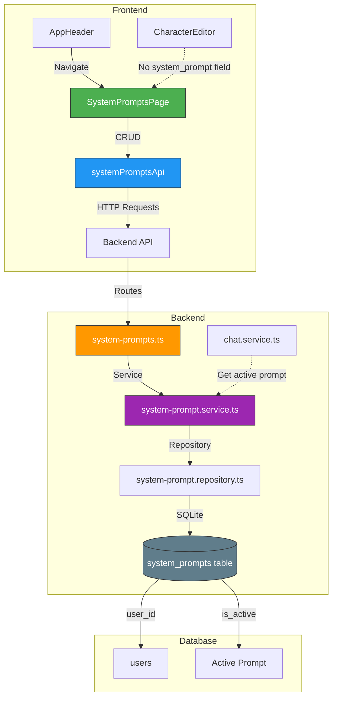

# Архитектура системы коллекций системных промптов для HomeTavern

## Обзор

Этот документ описывает архитектуру для добавления системы управления коллекцией системных промптов. Пользователи смогут создавать, редактировать, выбирать и управлять системными промптами, которые будут применяться ко всем чатам вместо того, чтобы хранить их в каждом персонаже отдельно.

---

## 1. База данных

### 1.1 Новая таблица `system_prompts`

```sql
CREATE TABLE IF NOT EXISTS system_prompts (
  id INTEGER PRIMARY KEY AUTOINCREMENT,
  user_id INTEGER NOT NULL,
  name TEXT NOT NULL,
  description TEXT,
  prompt_text TEXT NOT NULL,
  is_active INTEGER DEFAULT 0,
  created_at DATETIME DEFAULT CURRENT_TIMESTAMP,
  updated_at DATETIME DEFAULT CURRENT_TIMESTAMP,
  FOREIGN KEY (user_id) REFERENCES users(id) ON DELETE CASCADE
);

-- Индекс для быстрого поиска активного промпта пользователя
CREATE INDEX IF NOT EXISTS idx_system_prompts_user_active ON system_prompts(user_id, is_active);
```

### 1.2 Поля таблицы

| Поле | Тип | Описание |
|------|-----|----------|
| `id` | INTEGER | Первичный ключ |
| `user_id` | INTEGER | ID владельца (пользователя) |
| `name` | TEXT | Название промпта (обязательное) |
| `description` | TEXT | Краткое описание промпта |
| `prompt_text` | TEXT | Текст системного промпта |
| `is_active` | INTEGER | Флаг активного промпта (0 или 1) |
| `created_at` | DATETIME | Дата создания |
| `updated_at` | DATETIME | Дата последнего обновления |

### 1.3 Миграция

Добавить в `server/src/config/database.ts`:

```typescript
// Миграция: Создание таблицы system_prompts
try {
  db.exec(`
    CREATE TABLE IF NOT EXISTS system_prompts (
      id INTEGER PRIMARY KEY AUTOINCREMENT,
      user_id INTEGER NOT NULL,
      name TEXT NOT NULL,
      description TEXT,
      prompt_text TEXT NOT NULL,
      is_active INTEGER DEFAULT 0,
      created_at DATETIME DEFAULT CURRENT_TIMESTAMP,
      updated_at DATETIME DEFAULT CURRENT_TIMESTAMP,
      FOREIGN KEY (user_id) REFERENCES users(id) ON DELETE CASCADE
    );
    
    CREATE INDEX IF NOT EXISTS idx_system_prompts_user_active ON system_prompts(user_id, is_active);
  `);
  
  console.log('[Database] Created table: system_prompts');
} catch (error) {
  const errorMessage = (error as Error).message;
  if (errorMessage.includes('duplicate table')) {
    console.log('[Database] Table system_prompts already exists');
  } else {
    console.error('[Database] system_prompts migration error:', error);
  }
}
```

---

## 2. Backend API

### 2.1 Типы (server/src/types/index.ts)

```typescript
// System Prompt types
export interface SystemPrompt {
  id: number;
  user_id: number;
  name: string;
  description: string | null;
  prompt_text: string;
  is_active: number;
  created_at: string;
  updated_at: string;
}

export interface CreateSystemPromptInput {
  name: string;
  description?: string;
  prompt_text: string;
  is_active?: boolean;
}

export interface UpdateSystemPromptInput {
  name?: string;
  description?: string;
  prompt_text?: string;
  is_active?: boolean;
}
```

### 2.2 Репозиторий (server/src/repositories/system-prompt.repository.ts)

```typescript
import db from '../config/database';
import { SystemPrompt, CreateSystemPromptInput, UpdateSystemPromptInput } from '../types';

export const systemPromptRepository = {
  /**
   * Получение всех промптов пользователя
   */
  getPromptsByUserId: (userId: number): SystemPrompt[] => {
    const stmt = db.prepare('SELECT * FROM system_prompts WHERE user_id = ? ORDER BY is_active DESC, created_at DESC');
    return stmt.all(userId) as SystemPrompt[];
  },

  /**
   * Получение активного промпта пользователя
   */
  getActivePromptByUserId: (userId: number): SystemPrompt | undefined => {
    const stmt = db.prepare('SELECT * FROM system_prompts WHERE user_id = ? AND is_active = 1 LIMIT 1');
    return stmt.get(userId) as SystemPrompt | undefined;
  },

  /**
   * Получение промпта по ID
   */
  getPromptById: (id: number): SystemPrompt | undefined => {
    const stmt = db.prepare('SELECT * FROM system_prompts WHERE id = ?');
    return stmt.get(id) as SystemPrompt | undefined;
  },

  /**
   * Создание промпта
   */
  createPrompt: (userId: number, data: CreateSystemPromptInput): SystemPrompt => {
    // Если устанавливаем is_active = true, сначала отключаем другие промпты
    if (data.is_active) {
      db.prepare('UPDATE system_prompts SET is_active = 0 WHERE user_id = ?').run(userId);
    }
    
    const stmt = db.prepare(`
      INSERT INTO system_prompts (user_id, name, description, prompt_text, is_active)
      VALUES (?, ?, ?, ?, ?)
    `);
    const result = stmt.run(
      userId,
      data.name,
      data.description || null,
      data.prompt_text,
      data.is_active ? 1 : 0
    );
    
    return systemPromptRepository.getPromptById(result.lastInsertRowid as number)!;
  },

  /**
   * Обновление промпта
   */
  updatePrompt: (id: number, data: UpdateSystemPromptInput): SystemPrompt | undefined => {
    const existing = systemPromptRepository.getPromptById(id);
    if (!existing) return undefined;

    const stmt = db.prepare(`
      UPDATE system_prompts
      SET name = COALESCE(?, name),
          description = COALESCE(?, description),
          prompt_text = COALESCE(?, prompt_text),
          is_active = CASE WHEN COALESCE(?, is_active) = 1 THEN 
            (UPDATE system_prompts SET is_active = 0 WHERE user_id = ? AND id != ?),
            1
          ELSE is_active END,
          updated_at = CURRENT_TIMESTAMP
      WHERE id = ?
    `);
    
    // Упрощенная версия - просто обновляем поля
    const updateStmt = db.prepare(`
      UPDATE system_prompts
      SET name = COALESCE(?, name),
          description = COALESCE(?, description),
          prompt_text = COALESCE(?, prompt_text),
          updated_at = CURRENT_TIMESTAMP
      WHERE id = ?
    `);
    updateStmt.run(data.name, data.description, data.prompt_text, id);
    
    // Обработка is_active отдельно
    if (data.is_active !== undefined) {
      if (data.is_active) {
        db.prepare('UPDATE system_prompts SET is_active = 0 WHERE user_id = ?').run(existing.user_id);
        db.prepare('UPDATE system_prompts SET is_active = 1 WHERE id = ?').run(id);
      }
    }
    
    return systemPromptRepository.getPromptById(id);
  },

  /**
   * Активация промпта
   */
  activatePrompt: (id: number, userId: number): SystemPrompt | undefined => {
    // Отключаем все другие промпты пользователя
    db.prepare('UPDATE system_prompts SET is_active = 0 WHERE user_id = ?').run(userId);
    
    // Активируем выбранный промпт
    const result = db.prepare('UPDATE system_prompts SET is_active = 1 WHERE id = ? AND user_id = ?').run(id, userId);
    
    if (result.changes === 0) return undefined;
    
    return systemPromptRepository.getPromptById(id);
  },

  /**
   * Удаление промпта
   */
  deletePrompt: (id: number): boolean => {
    const stmt = db.prepare('DELETE FROM system_prompts WHERE id = ?');
    const result = stmt.run(id);
    return result.changes > 0;
  },
};
```

### 2.3 Сервис (server/src/services/system-prompt.service.ts)

```typescript
import { systemPromptRepository } from '../repositories/system-prompt.repository';
import { SystemPrompt, CreateSystemPromptInput, UpdateSystemPromptInput } from '../types';

export class SystemPromptService {
  /**
   * Получение всех промптов пользователя
   */
  getAllPrompts(userId: number): SystemPrompt[] {
    return systemPromptRepository.getPromptsByUserId(userId);
  }

  /**
   * Получение активного промпта пользователя
   */
  getActivePrompt(userId: number): SystemPrompt | null {
    return systemPromptRepository.getActivePromptByUserId(userId) || null;
  }

  /**
   * Получение промпта по ID
   */
  getPrompt(id: number, userId: number): SystemPrompt | null {
    const prompt = systemPromptRepository.getPromptById(id);
    if (!prompt || prompt.user_id !== userId) {
      return null;
    }
    return prompt;
  }

  /**
   * Создание промпта
   */
  createPrompt(userId: number, data: CreateSystemPromptInput): SystemPrompt {
    // Валидация
    if (!data.name || data.name.trim().length === 0) {
      throw new Error('Name is required');
    }
    if (!data.prompt_text || data.prompt_text.trim().length === 0) {
      throw new Error('Prompt text is required');
    }
    
    return systemPromptRepository.createPrompt(userId, data);
  }

  /**
   * Обновление промпта
   */
  updatePrompt(id: number, userId: number, data: UpdateSystemPromptInput): SystemPrompt | null {
    const existing = systemPromptRepository.getPromptById(id);
    if (!existing || existing.user_id !== userId) {
      return null;
    }
    
    return systemPromptRepository.updatePrompt(id, data);
  }

  /**
   * Активация промпта
   */
  activatePrompt(id: number, userId: number): SystemPrompt | null {
    const existing = systemPromptRepository.getPromptById(id);
    if (!existing || existing.user_id !== userId) {
      return null;
    }
    
    return systemPromptRepository.activatePrompt(id, userId);
  }

  /**
   * Удаление промпта
   */
  deletePrompt(id: number, userId: number): boolean {
    const existing = systemPromptRepository.getPromptById(id);
    if (!existing || existing.user_id !== userId) {
      return false;
    }
    
    return systemPromptRepository.deletePrompt(id);
  }
}

export const systemPromptService = new SystemPromptService();
```

### 2.4 Роуты (server/src/routes/system-prompts.ts)

```typescript
import { Router, Response } from 'express';
import { authenticate, AuthenticatedRequest } from '../middleware/auth';
import { systemPromptService } from '../services/system-prompt.service';
import { CreateSystemPromptInput, UpdateSystemPromptInput } from '../types';

const router = Router();

// Все роуты требуют аутентификации
router.use(authenticate);

/**
 * GET /api/system-prompts
 * Получение списка всех промптов пользователя
 */
router.get('/', (req: AuthenticatedRequest, res: Response) => {
  try {
    const userId = req.user!.userId;
    const prompts = systemPromptService.getAllPrompts(userId);
    res.status(200).json(prompts);
  } catch (error) {
    res.status(500).json({ error: 'Internal server error' });
  }
});

/**
 * GET /api/system-prompts/active
 * Получение активного промпта пользователя
 */
router.get('/active', (req: AuthenticatedRequest, res: Response) => {
  try {
    const userId = req.user!.userId;
    const prompt = systemPromptService.getActivePrompt(userId);
    
    if (!prompt) {
      return res.status(404).json({ error: 'No active system prompt found' });
    }
    
    res.status(200).json(prompt);
  } catch (error) {
    res.status(500).json({ error: 'Internal server error' });
  }
});

/**
 * GET /api/system-prompts/:id
 * Получение промпта по ID
 */
router.get('/:id', (req: AuthenticatedRequest, res: Response) => {
  try {
    const userId = req.user!.userId;
    const promptId = parseInt(req.params.id, 10);
    
    if (isNaN(promptId)) {
      return res.status(400).json({ error: 'Invalid prompt ID' });
    }
    
    const prompt = systemPromptService.getPrompt(promptId, userId);
    
    if (!prompt) {
      return res.status(404).json({ error: 'System prompt not found or access denied' });
    }
    
    res.status(200).json(prompt);
  } catch (error) {
    res.status(500).json({ error: 'Internal server error' });
  }
});

/**
 * POST /api/system-prompts
 * Создание нового промпта
 */
router.post('/', (req: AuthenticatedRequest, res: Response) => {
  try {
    const userId = req.user!.userId;
    const data: CreateSystemPromptInput = req.body;
    
    const prompt = systemPromptService.createPrompt(userId, data);
    res.status(201).json(prompt);
  } catch (error) {
    const error_ = error as Error & { statusCode?: number };
    const statusCode = error_.statusCode || 400;
    res.status(statusCode).json({ error: error_.message });
  }
});

/**
 * PUT /api/system-prompts/:id
 * Обновление промпта
 */
router.put('/:id', (req: AuthenticatedRequest, res: Response) => {
  try {
    const userId = req.user!.userId;
    const promptId = parseInt(req.params.id, 10);
    const data: UpdateSystemPromptInput = req.body;
    
    if (isNaN(promptId)) {
      return res.status(400).json({ error: 'Invalid prompt ID' });
    }
    
    const prompt = systemPromptService.updatePrompt(promptId, userId, data);
    
    if (!prompt) {
      return res.status(404).json({ error: 'System prompt not found or access denied' });
    }
    
    res.status(200).json(prompt);
  } catch (error) {
    res.status(500).json({ error: 'Internal server error' });
  }
});

/**
 * PUT /api/system-prompts/:id/activate
 * Установка промпта активным
 */
router.put('/:id/activate', (req: AuthenticatedRequest, res: Response) => {
  try {
    const userId = req.user!.userId;
    const promptId = parseInt(req.params.id, 10);
    
    if (isNaN(promptId)) {
      return res.status(400).json({ error: 'Invalid prompt ID' });
    }
    
    const prompt = systemPromptService.activatePrompt(promptId, userId);
    
    if (!prompt) {
      return res.status(404).json({ error: 'System prompt not found or access denied' });
    }
    
    res.status(200).json(prompt);
  } catch (error) {
    res.status(500).json({ error: 'Internal server error' });
  }
});

/**
 * DELETE /api/system-prompts/:id
 * Удаление промпта
 */
router.delete('/:id', (req: AuthenticatedRequest, res: Response) => {
  try {
    const userId = req.user!.userId;
    const promptId = parseInt(req.params.id, 10);
    
    if (isNaN(promptId)) {
      return res.status(400).json({ error: 'Invalid prompt ID' });
    }
    
    const deleted = systemPromptService.deletePrompt(promptId, userId);
    
    if (!deleted) {
      return res.status(404).json({ error: 'System prompt not found or access denied' });
    }
    
    res.status(200).json({ message: 'System prompt deleted successfully' });
  } catch (error) {
    res.status(500).json({ error: 'Internal server error' });
  }
});

export default router;
```

### 2.5 Регистрация роута в server/src/index.ts

Добавить импорт и регистрацию роута:

```typescript
import systemPromptsRouter from './routes/system-prompts';

// ... в начале регистрации роутов:
app.use('/api/system-prompts', systemPromptsRouter);
```

---

## 3. Frontend

### 3.1 Типы (client/src/types/index.ts)

```typescript
// System Prompt types
export interface SystemPrompt {
  id: number;
  user_id: number;
  name: string;
  description: string | null;
  prompt_text: string;
  is_active: number;
  created_at: string;
  updated_at: string;
}

export interface CreateSystemPromptInput {
  name: string;
  description?: string;
  prompt_text: string;
  is_active?: boolean;
}

export interface UpdateSystemPromptInput {
  name?: string;
  description?: string;
  prompt_text?: string;
  is_active?: boolean;
}
```

### 3.2 API сервис (client/src/services/api.ts)

```typescript
// System Prompts API
export const systemPromptsApi = {
  getAll: () => api.get<SystemPrompt[]>('/system-prompts'),
  getActive: () => api.get<SystemPrompt>('/system-prompts/active'),
  getById: (id: number) => api.get<SystemPrompt>(`/system-prompts/${id}`),
  create: (data: CreateSystemPromptInput) =>
    api.post<SystemPrompt>('/system-prompts', data),
  update: (id: number, data: UpdateSystemPromptInput) =>
    api.put<SystemPrompt>(`/system-prompts/${id}`, data),
  activate: (id: number) =>
    api.put<SystemPrompt>(`/system-prompts/${id}/activate`),
  delete: (id: number) => api.delete(`/system-prompts/${id}`),
};
```

### 3.3 Страница SystemPromptsPage (client/src/pages/SystemPromptsPage.tsx)

```typescript
import React, { useState, useEffect, useCallback } from 'react';
import { systemPromptsApi } from '../services/api';
import { SystemPrompt } from '../types';
import AppHeader from '../components/common/AppHeader';

const SystemPromptsPage: React.FC = () => {
  const [prompts, setPrompts] = useState<SystemPrompt[]>([]);
  const [selectedPromptId, setSelectedPromptId] = useState<number | null>(null);
  const [isLoading, setIsLoading] = useState(true);
  const [error, setError] = useState<string | null>(null);
  const [showEditor, setShowEditor] = useState(false);
  const [editingPrompt, setEditingPrompt] = useState<SystemPrompt | null>(null);
  const [isDeleteConfirmOpen, setIsDeleteConfirmOpen] = useState(false);
  const [promptToDelete, setPromptToDelete] = useState<number | null>(null);

  const fetchPrompts = useCallback(async () => {
    try {
      setIsLoading(true);
      setError(null);
      const response = await systemPromptsApi.getAll();
      setPrompts(response.data);
      
      // Найти активный промпт
      const activePrompt = response.data.find(p => p.is_active === 1);
      if (activePrompt) {
        setSelectedPromptId(activePrompt.id);
      }
    } catch (err: any) {
      setError(err.response?.data?.message || 'Ошибка при загрузке промптов');
    } finally {
      setIsLoading(false);
    }
  }, []);

  useEffect(() => {
    fetchPrompts();
  }, [fetchPrompts]);

  const handleCreateClick = () => {
    setEditingPrompt(null);
    setShowEditor(true);
  };

  const handleEditClick = (prompt: SystemPrompt) => {
    setEditingPrompt(prompt);
    setShowEditor(true);
  };

  const handleSelectClick = async (id: number) => {
    try {
      await systemPromptsApi.activate(id);
      setSelectedPromptId(id);
      fetchPrompts();
    } catch (err: any) {
      alert(err.response?.data?.message || 'Ошибка при установке активного промпта');
    }
  };

  const handleDeleteClick = (id: number) => {
    setPromptToDelete(id);
    setIsDeleteConfirmOpen(true);
  };

  const confirmDelete = async () => {
    if (promptToDelete === null) return;
    
    try {
      await systemPromptsApi.delete(promptToDelete);
      if (selectedPromptId === promptToDelete) {
        setSelectedPromptId(null);
      }
      fetchPrompts();
    } catch (err: any) {
      alert(err.response?.data?.message || 'Ошибка при удалении промпта');
    } finally {
      setIsDeleteConfirmOpen(false);
      setPromptToDelete(null);
    }
  };

  const handleSave = async (promptData: any) => {
    try {
      if (editingPrompt?.id) {
        await systemPromptsApi.update(editingPrompt.id, promptData);
      } else {
        await systemPromptsApi.create(promptData);
      }
      setShowEditor(false);
      setEditingPrompt(null);
      fetchPrompts();
    } catch (err: any) {
      alert(err.response?.data?.message || 'Ошибка при сохранении промпта');
    }
  };

  const selectedPrompt = prompts.find(p => p.id === selectedPromptId);

  return (
    <div className="min-h-screen bg-gradient-to-br from-gray-900 via-gray-800 to-gray-900">
      {/* Header */}
      <AppHeader title="Системные промпты" />

      {/* Main content */}
      <div className="container mx-auto px-4 py-8">
        {/* Error message */}
        {error && (
          <div className="mb-6 p-4 bg-red-900/30 border border-red-700 rounded-lg">
            <p className="text-red-400">{error}</p>
          </div>
        )}

        {/* Action buttons */}
        <div className="flex flex-wrap gap-4 mb-6">
          <button
            onClick={handleCreateClick}
            className="flex items-center gap-2 px-4 py-3 bg-gray-600 hover:bg-gray-500 rounded-lg font-semibold text-white transition"
          >
            <svg className="w-5 h-5" fill="none" stroke="currentColor" viewBox="0 0 24 24">
              <path strokeLinecap="round" strokeLinejoin="round" strokeWidth={2} d="M12 4v16m8-8H4" />
            </svg>
            Создать промпт
          </button>
        </div>

        {/* Loading state */}
        {isLoading && (
          <div className="flex items-center justify-center py-12">
            <svg className="animate-spin h-10 w-10 text-gray-500" xmlns="http://www.w3.org/2000/svg" fill="none" viewBox="0 0 24 24">
              <circle className="opacity-25" cx="12" cy="12" r="10" stroke="currentColor" strokeWidth="4"></circle>
              <path className="opacity-75" fill="currentColor" d="M4 12a8 8 0 018-8V0C5.373 0 0 5.373 0 12h4zm2 5.291A7.962 7.962 0 014 12H0c0 3.042 1.135 5.824 3 7.938l3-2.647z"></path>
            </svg>
          </div>
        )}

        {/* Empty state */}
        {!isLoading && prompts.length === 0 && (
          <div className="text-center py-12">
            <svg className="w-20 h-20 text-gray-600 mx-auto mb-4" fill="none" stroke="currentColor" viewBox="0 0 24 24">
              <path strokeLinecap="round" strokeLinejoin="round" strokeWidth={2} d="M9 12h6m-6 4h6m2 5H7a2 2 0 01-2-2V5a2 2 0 012-2h5.586a1 1 0 01.707.293l5.414 5.414a1 1 0 01.293.707V19a2 2 0 01-2 2z" />
            </svg>
            <p className="text-gray-400 text-lg">У вас пока нет системных промптов</p>
            <p className="text-gray-500 mt-2">Создайте первый промпт!</p>
          </div>
        )}

        {/* Two-column layout */}
        {!isLoading && prompts.length > 0 && (
          <div className="grid grid-cols-1 lg:grid-cols-3 gap-6">
            {/* Left column: Prompt list */}
            <div className="lg:col-span-1">
              <div className="bg-gray-800/50 rounded-xl border border-gray-700 overflow-hidden">
                <div className="p-4 border-b border-gray-700">
                  <h3 className="text-lg font-semibold text-white">Список промптов</h3>
                </div>
                <div className="divide-y divide-gray-700 max-h-[600px] overflow-y-auto">
                  {prompts.map((prompt) => (
                    <div
                      key={prompt.id}
                      onClick={() => setSelectedPromptId(prompt.id)}
                      className={`p-4 cursor-pointer transition ${
                        selectedPromptId === prompt.id
                          ? 'bg-gray-700/50 border-2 border-gray-500'
                          : 'hover:bg-gray-700/30 border-2 border-transparent'
                      }`}
                    >
                      <div className="flex items-center justify-between">
                        <div className="flex-1 min-w-0">
                          <h4 className="text-white font-medium truncate">{prompt.name}</h4>
                          {prompt.description && (
                            <p className="text-gray-400 text-sm mt-1 truncate">{prompt.description}</p>
                          )}
                        </div>
                        {prompt.is_active === 1 && (
                          <span className="ml-2 px-2 py-1 bg-green-900/50 text-green-400 text-xs rounded">
                            Активный
                          </span>
                        )}
                      </div>
                      <div className="flex items-center gap-2 mt-3">
                        <button
                          onClick={(e) => {
                            e.stopPropagation();
                            handleSelectClick(prompt.id);
                          }}
                          className="flex-1 py-1.5 px-3 bg-gray-600 hover:bg-gray-500 rounded-lg text-white text-xs transition"
                        >
                          Выбрать
                        </button>
                        <button
                          onClick={(e) => {
                            e.stopPropagation();
                            handleEditClick(prompt);
                          }}
                          className="p-1.5 text-gray-400 hover:text-white hover:bg-gray-600 rounded transition"
                        >
                          <svg className="w-4 h-4" fill="none" stroke="currentColor" viewBox="0 0 24 24">
                            <path strokeLinecap="round" strokeLinejoin="round" strokeWidth={2} d="M11 5H6a2 2 0 00-2 2v11a2 2 0 002 2h11a2 2 0 002-2v-5m-1.414-9.414a2 2 0 112.828 2.828L11.828 17.293a2 2 0 01-2.828 0l-2.829-2.828a2 2 0 010-2.828l8.486-8.485zM18 17h3" />
                          </svg>
                        </button>
                        <button
                          onClick={(e) => {
                            e.stopPropagation();
                            handleDeleteClick(prompt.id);
                          }}
                          className="p-1.5 text-gray-400 hover:text-red-400 hover:bg-red-900/30 rounded transition"
                        >
                          <svg className="w-4 h-4" fill="none" stroke="currentColor" viewBox="0 0 24 24">
                            <path strokeLinecap="round" strokeLinejoin="round" strokeWidth={2} d="M19 7l-.867 12.142A2 2 0 0116.138 21H7.862a2 2 0 01-1.995-1.858L5 7m5 4v6m4-6v6m1-10V4a1 1 0 00-1-1h-4a1 1 0 00-1 1v3M4 7h16" />
                          </svg>
                        </button>
                      </div>
                    </div>
                  ))}
                </div>
              </div>
            </div>

            {/* Right column: Prompt editor */}
            <div className="lg:col-span-2">
              {selectedPrompt ? (
                <div className="bg-gray-800/50 rounded-xl border border-gray-700 p-6 space-y-4">
                  <div>
                    <label className="block text-sm font-medium text-gray-300 mb-2">
                      Название
                    </label>
                    <input
                      type="text"
                      value={selectedPrompt.name}
                      readOnly
                      className="w-full px-4 py-3 bg-gray-700/50 border border-gray-600 rounded-lg text-white placeholder-gray-500 cursor-not-allowed"
                    />
                  </div>
                  <div>
                    <label className="block text-sm font-medium text-gray-300 mb-2">
                      Описание
                    </label>
                    <textarea
                      value={selectedPrompt.description || ''}
                      readOnly
                      rows={2}
                      className="w-full px-4 py-3 bg-gray-700/50 border border-gray-600 rounded-lg text-white placeholder-gray-500 cursor-not-allowed resize-none"
                    />
                  </div>
                  <div>
                    <label className="block text-sm font-medium text-gray-300 mb-2">
                      Текст промпта
                    </label>
                    <textarea
                      value={selectedPrompt.prompt_text}
                      readOnly
                      rows={15}
                      className="w-full px-4 py-3 bg-gray-700/50 border border-gray-600 rounded-lg text-white placeholder-gray-500 cursor-not-allowed resize-none font-mono text-sm"
                    />
                  </div>
                </div>
              ) : (
                <div className="bg-gray-800/30 rounded-xl border border-gray-700 p-12 text-center">
                  <svg className="w-16 h-16 text-gray-600 mx-auto mb-4" fill="none" stroke="currentColor" viewBox="0 0 24 24">
                    <path strokeLinecap="round" strokeLinejoin="round" strokeWidth={2} d="M15 15l-2 5L9 9l11 4-5 2zm0 0l5 5M7.188 2.239l.777 2.897M5.136 7.965l-2.898-.777M13.95 4.05l-2.122 2.122m-5.657 5.656l-2.12 2.122" />
                  </svg>
                  <p className="text-gray-400 text-lg">Выберите промпт из списка для просмотра</p>
                </div>
              )}
            </div>
          </div>
        )}
      </div>

      {/* Editor modal */}
      {showEditor && (
        <SystemPromptEditor
          prompt={editingPrompt}
          onSave={handleSave}
          onCancel={() => {
            setShowEditor(false);
            setEditingPrompt(null);
          }}
        />
      )}

      {/* Delete confirmation modal */}
      {isDeleteConfirmOpen && (
        <div className="fixed inset-0 bg-black/60 backdrop-blur-sm flex items-center justify-center p-4 z-50">
          <div className="bg-gray-800 rounded-2xl p-6 max-w-sm w-full border border-gray-700">
            <h3 className="text-xl font-bold text-white mb-4">Подтверждение</h3>
            <p className="text-gray-400 mb-6">
              Вы уверены, что хотите удалить этот промпт? Это действие нельзя отменить.
            </p>
            <div className="flex gap-4">
              <button
                onClick={() => setIsDeleteConfirmOpen(false)}
                className="flex-1 py-3 px-4 bg-gray-700 hover:bg-gray-600 rounded-lg font-semibold text-white transition"
              >
                Отмена
              </button>
              <button
                onClick={confirmDelete}
                className="flex-1 py-3 px-4 bg-red-600 hover:bg-red-700 rounded-lg font-semibold text-white transition"
              >
                Удалить
              </button>
            </div>
          </div>
        </div>
      )}
    </div>
  );
};

export default SystemPromptsPage;
```

### 3.4 Компонент редактора (client/src/components/system-prompts/SystemPromptEditor.tsx)

```typescript
import React, { useState, useEffect } from 'react';
import { SystemPrompt, CreateSystemPromptInput, UpdateSystemPromptInput } from '../../types';

interface SystemPromptEditorProps {
  prompt?: SystemPrompt | null;
  onSave: (promptData: CreateSystemPromptInput | UpdateSystemPromptInput) => void;
  onCancel: () => void;
}

const SystemPromptEditor: React.FC<SystemPromptEditorProps> = ({
  prompt,
  onSave,
  onCancel,
}) => {
  const isEditing = !!prompt?.id;
  
  const [formData, setFormData] = useState({
    name: '',
    description: '',
    prompt_text: '',
    is_active: false,
  });
  
  const [errors, setErrors] = useState<Record<string, string>>({});
  const [isLoading, setIsLoading] = useState(false);

  useEffect(() => {
    if (prompt) {
      setFormData({
        name: prompt.name || '',
        description: prompt.description || '',
        prompt_text: prompt.prompt_text || '',
        is_active: prompt.is_active === 1,
      });
    }
  }, [prompt]);

  const validateFields = (): boolean => {
    const newErrors: Record<string, string> = {};

    if (!formData.name.trim()) {
      newErrors.name = 'Название обязательно';
    }

    if (!formData.prompt_text.trim()) {
      newErrors.prompt_text = 'Текст промпта обязателен';
    }

    setErrors(newErrors);
    return Object.keys(newErrors).length === 0;
  };

  const handleInputChange = (
    e: React.ChangeEvent<HTMLInputElement | HTMLTextAreaElement>
  ) => {
    const { name, value, type } = e.target;
    const checked = (e.target as HTMLInputElement).checked;
    
    setFormData((prev) => ({
      ...prev,
      [name]: type === 'checkbox' ? checked : value,
    }));
    
    if (errors[name]) {
      setErrors((prev) => ({ ...prev, [name]: '' }));
    }
  };

  const handleSubmit = (e: React.FormEvent) => {
    e.preventDefault();
    
    if (!validateFields()) return;
    
    setIsLoading(true);
    
    const payload = {
      name: formData.name.trim(),
      description: formData.description.trim() || undefined,
      prompt_text: formData.prompt_text.trim(),
      is_active: formData.is_active,
    };
    
    onSave(payload);
    setIsLoading(false);
  };

  return (
    <div className="fixed inset-0 bg-black/60 backdrop-blur-sm flex items-center justify-center p-4 z-50">
      <div className="bg-gray-800 rounded-2xl shadow-2xl w-full max-w-4xl max-h-[90vh] overflow-y-auto border border-gray-700">
        {/* Header */}
        <div className="sticky top-0 bg-gray-800 border-b border-gray-700 px-6 py-4 flex items-center justify-between">
          <h2 className="text-xl font-bold text-white">
            {isEditing ? 'Редактировать промпт' : 'Создать промпт'}
          </h2>
          <button
            onClick={onCancel}
            className="p-2 text-gray-400 hover:text-white hover:bg-gray-700 rounded-lg transition"
          >
            <svg className="w-6 h-6" fill="none" stroke="currentColor" viewBox="0 0 24 24">
              <path strokeLinecap="round" strokeLinejoin="round" strokeWidth={2} d="M6 18L18 6M6 6l12 12" />
            </svg>
          </button>
        </div>

        {/* Form */}
        <form onSubmit={handleSubmit} className="p-6 space-y-6">
          {/* Name field */}
          <div>
            <label htmlFor="name" className="block text-sm font-medium text-gray-300 mb-2">
              Название *
            </label>
            <input
              type="text"
              id="name"
              name="name"
              value={formData.name}
              onChange={handleInputChange}
              className={`w-full px-4 py-3 bg-gray-700/50 border rounded-lg focus:outline-none focus:ring-2 focus:ring-gray-500 transition ${
                errors.name ? 'border-red-500' : 'border-gray-600'
              } text-white placeholder-gray-500`}
              placeholder="Например: Базовый промпт"
              disabled={isLoading}
            />
            {errors.name && <p className="mt-1 text-sm text-red-400">{errors.name}</p>}
          </div>

          {/* Description field */}
          <div>
            <label htmlFor="description" className="block text-sm font-medium text-gray-300 mb-2">
              Описание
            </label>
            <textarea
              id="description"
              name="description"
              value={formData.description}
              onChange={handleInputChange}
              rows={2}
              className="w-full px-4 py-3 bg-gray-700/50 border border-gray-600 rounded-lg focus:outline-none focus:ring-2 focus:ring-gray-500 transition resize-none text-white placeholder-gray-500"
              placeholder="Краткое описание промпта..."
              disabled={isLoading}
            />
          </div>

          {/* Prompt text field */}
          <div>
            <label htmlFor="prompt_text" className="block text-sm font-medium text-gray-300 mb-2">
              Текст промпта *
            </label>
            <textarea
              id="prompt_text"
              name="prompt_text"
              value={formData.prompt_text}
              onChange={handleInputChange}
              rows={15}
              className={`w-full px-4 py-3 bg-gray-700/50 border rounded-lg focus:outline-none focus:ring-2 focus:ring-gray-500 transition resize-none font-mono text-sm ${
                errors.prompt_text ? 'border-red-500' : 'border-gray-600'
              } text-white placeholder-gray-500`}
              placeholder="Введите системный промпт..."
              disabled={isLoading}
            />
            {errors.prompt_text && <p className="mt-1 text-sm text-red-400">{errors.prompt_text}</p>}
          </div>

          {/* Is active checkbox */}
          <div className="flex items-center">
            <input
              type="checkbox"
              id="is_active"
              name="is_active"
              checked={formData.is_active}
              onChange={handleInputChange}
              className="w-4 h-4 bg-gray-700 border-gray-600 rounded text-gray-500 focus:ring-gray-500"
            />
            <label htmlFor="is_active" className="ml-2 text-sm font-medium text-gray-300">
              Установить активным
            </label>
          </div>

          {/* Action buttons */}
          <div className="flex gap-4 pt-4 border-t border-gray-700">
            <button
              type="button"
              onClick={onCancel}
              disabled={isLoading}
              className="flex-1 py-3 px-4 bg-gray-700 hover:bg-gray-600 disabled:bg-gray-800 disabled:cursor-not-allowed rounded-lg font-semibold text-white transition"
            >
              Отмена
            </button>
            <button
              type="submit"
              disabled={isLoading}
              className="flex-1 py-3 px-4 bg-gray-600 hover:bg-gray-500 disabled:bg-gray-700 disabled:cursor-not-allowed rounded-lg font-semibold text-white transition"
            >
              {isLoading ? 'Сохранение...' : 'Сохранить'}
            </button>
          </div>
        </form>
      </div>
    </div>
  );
};

export default SystemPromptEditor;
```

### 3.5 Обновление навигации в AppHeader.tsx

Добавить кнопку для страницы системных промптов:

```typescript
// В AppHeader.tsx добавить состояние:
const isSystemPromptsActive = location.pathname === '/system-prompts';

// Добавить кнопку в навигацию:
{/* Кнопка Системные промпты */}
<button
  onClick={() => navigate('/system-prompts')}
  className={`p-2 rounded-lg transition ${
    isSystemPromptsActive
      ? 'text-white bg-gray-700'
      : 'text-gray-400 hover:text-white hover:bg-gray-700'
  }`}
  title="Системные промпты"
>
  <svg className="w-6 h-6" fill="none" stroke="currentColor" viewBox="0 0 24 24">
    <path strokeLinecap="round" strokeLinejoin="round" strokeWidth={2} d="M9 12h6m-6 4h6m2 5H7a2 2 0 01-2-2V5a2 2 0 012-2h5.586a1 1 0 01.707.293l5.414 5.414a1 1 0 01.293.707V19a2 2 0 01-2 2z" />
  </svg>
</button>
```

### 3.6 Обновление App.tsx

Добавить роут для страницы системных промптов:

```typescript
import SystemPromptsPage from './pages/SystemPromptsPage';

// В Routes добавить:
<Route
  path="/system-prompts"
  element={
    <ProtectedRoute>
      <SystemPromptsPage />
    </ProtectedRoute>
  }
/>
```

### 3.7 Обновление CharacterEditor.tsx

Удалить поле `system_prompt` из формы:

1. Удалить `system_prompt` из состояния `formData`
2. Удалить поле из JSX
3. Удалить из валидации и обработки

### 3.8 Обновление типов Character

В `client/src/types/index.ts` удалить `system_prompt` из интерфейса `Character`:

```typescript
export interface Character {
  id?: number;
  name: string;
  description: string;
  short_description?: string;
  personality?: string;
  first_message: string;
  // system_prompt больше не используется
  avatar?: string;
  created_at?: string;
  updated_at?: string;
}
```

---

## 4. Интеграция с чатами

### 4.1 Изменения в создании чата

В `server/src/services/chat.service.ts` обновить метод `createChat`:

```typescript
async createChat(userId: number, characterId: number, title?: string): Promise<Chat> {
  // ... существующий код проверки ...

  // Получаем активный системный промпт пользователя
  const activeSystemPrompt = systemPromptService.getActivePrompt(userId);
  
  // Если есть активный промпт, используем его
  if (activeSystemPrompt) {
    console.log('[ChatService] Using active system prompt:', activeSystemPrompt.name);
    // Здесь можно сохранить промпт в контексте чата или использовать при генерации
  }

  // ... остальной код создания чата ...
}
```

### 4.2 Изменения в генерации ответа

В `server/src/services/llm.service.ts` или `server/src/services/context.service.ts` обновить логику формирования промпта:

```typescript
// Вместо использования system_prompt из персонажа:
// const systemPrompt = character.system_prompt || '';

// Использовать активный системный промпт пользователя:
const activeSystemPrompt = await systemPromptService.getActivePrompt(userId);
const systemPrompt = activeSystemPrompt?.prompt_text || '';
```

---

## 5. Миграция существующих данных

### 5.1 Стратегия миграции

При первом запуске после обновления:

1. **Создать дефолтный промпт** для каждого пользователя, если у него нет промптов
2. **Перенести system_prompt из персонажей** в коллекцию промптов пользователя

### 5.2 Миграционный скрипт

Добавить в `server/src/config/database.ts`:

```typescript
// Миграция: Перенос system_prompt из characters в system_prompts
try {
  // Получаем всех пользователей
  const users = db.prepare('SELECT DISTINCT user_id FROM characters').all() as any[];
  
  for (const user of users) {
    const userId = user.user_id as number;
    
    // Проверяем, есть ли уже промпты у пользователя
    const existingPrompts = db.prepare('SELECT COUNT(*) as count FROM system_prompts WHERE user_id = ?').get(userId) as any;
    
    if (existingPrompts.count === 0) {
      // Находим все уникальные system_prompt у персонажей пользователя
      const prompts = db.prepare(`
        SELECT DISTINCT system_prompt FROM characters 
        WHERE user_id = ? AND system_prompt IS NOT NULL AND system_prompt != ''
      `).all(userId) as any[];
      
      if (prompts.length > 0) {
        // Создаем промпты для пользователя
        const insertStmt = db.prepare(`
          INSERT INTO system_prompts (user_id, name, description, prompt_text, is_active)
          VALUES (?, ?, ?, ?, ?)
        `);
        
        prompts.forEach((row, index) => {
          const promptText = row.system_prompt as string;
          const isActive = index === 0 ? 1 : 0; // Первый промпт делаем активным
          
          insertStmt.run(
            userId,
            `Импортированный промпт ${index + 1}`,
            'Перенесен из персонажей',
            promptText,
            isActive
          );
        });
        
        console.log(`[Database] Migrated ${prompts.length} system prompts for user ${userId}`);
      }
    }
  }
  
  console.log('[Database] System prompts migration completed');
} catch (error) {
  console.error('[Database] System prompts migration error:', error);
}
```

### 5.3 Рекомендации

- **Опция 1**: Перенести все уникальные `system_prompt` из персонажей в коллекцию пользователя
- **Опция 2**: Создать один дефолтный промпт "Базовый" для всех пользователей
- **Опция 3**: Не делать миграцию, позволить пользователям создавать промпты вручную

Рекомендуется **Опция 1** для сохранения существующих данных.

---

## 6. Структура файлов

### Backend

```
server/src/
├── types/index.ts                    # Добавить SystemPrompt types
├── repositories/
│   └── system-prompt.repository.ts   # Новый файл
├── services/
│   └── system-prompt.service.ts      # Новый файл
├── routes/
│   └── system-prompts.ts             # Новый файл
└── config/
    └── database.ts                   # Добавить миграцию
```

### Frontend

```
client/src/
├── types/index.ts                    # Добавить SystemPrompt types
├── services/
│   └── api.ts                        # Добавить systemPromptsApi
├── pages/
│   └── SystemPromptsPage.tsx         # Новый файл
├── components/
│   ├── common/
│   │   └── AppHeader.tsx             # Добавить кнопку
│   └── system-prompts/
│       └── SystemPromptEditor.tsx    # Новый файл
└── App.tsx                           # Добавить роут
```

---

## 7. Диаграмма архитектуры



---

## 8. План реализации

### Этап 1: Backend
1. [ ] Добавить типы `SystemPrompt` в `server/src/types/index.ts`
2. [ ] Создать `server/src/repositories/system-prompt.repository.ts`
3. [ ] Создать `server/src/services/system-prompt.service.ts`
4. [ ] Создать `server/src/routes/system-prompts.ts`
5. [ ] Добавить миграцию таблицы в `server/src/config/database.ts`
6. [ ] Зарегистрировать роут в `server/src/index.ts`
7. [ ] Протестировать API endpoints

### Этап 2: Frontend
1. [ ] Добавить типы `SystemPrompt` в `client/src/types/index.ts`
2. [ ] Добавить `systemPromptsApi` в `client/src/services/api.ts`
3. [ ] Создать `client/src/components/system-prompts/SystemPromptEditor.tsx`
4. [ ] Создать `client/src/pages/SystemPromptsPage.tsx`
5. [ ] Обновить `client/src/components/common/AppHeader.tsx` (добавить кнопку)
6. [ ] Обновить `client/src/App.tsx` (добавить роут)
7. [ ] Протестировать UI

### Этап 3: Обновление персонажей
1. [ ] Удалить `system_prompt` из `client/src/types/index.ts` (Character interface)
2. [ ] Удалить поле `system_prompt` из `client/src/components/characters/CharacterEditor.tsx`
3. [ ] Удалить `system_prompt` из `server/src/types/index.ts` (Character interface)
4. [ ] Обновить `server/src/repositories/character.repository.ts` (удалить system_prompt из запросов)

### Этап 4: Интеграция с чатами
1. [ ] Обновить `server/src/services/chat.service.ts` (использовать активный промпт)
2. [ ] Обновить `server/src/services/llm.service.ts` или `context.service.ts` (применять промпт)
3. [ ] Протестировать создание чатов с активным промптом

### Этап 5: Миграция данных
1. [ ] Добавить миграционный скрипт в `server/src/config/database.ts`
2. [ ] Протестировать миграцию на существующих данных
3. [ ] Документировать процесс миграции

---

## 9. API Endpoints Summary

| Method | Endpoint | Описание |
|--------|----------|----------|
| GET | `/api/system-prompts` | Получить все промпты пользователя |
| GET | `/api/system-prompts/active` | Получить активный промпт |
| GET | `/api/system-prompts/:id` | Получить промпт по ID |
| POST | `/api/system-prompts` | Создать промпт |
| PUT | `/api/system-prompts/:id` | Обновить промпт |
| PUT | `/api/system-prompts/:id/activate` | Установить активным |
| DELETE | `/api/system-prompts/:id` | Удалить промпт |

---

## 10. Примечания

1. **Безопасность**: Все роуты защищены аутентификацией, пользователи могут видеть только свои промпты
2. **Активный промпт**: У пользователя может быть только один активный промпт в любой момент времени
3. **Обратная совместимость**: Миграция перенесет существующие `system_prompt` из персонажей
4. **Производительность**: Индексы на `user_id` и `is_active` для быстрого поиска
